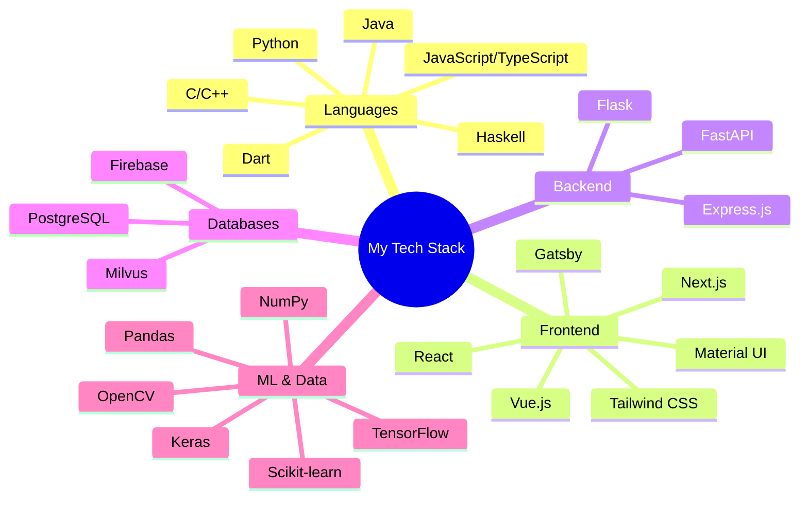

# 👋 Hey! I'm Bill (aka @IdkwhatImD0ing)

_Last updated: Feb 28 2025_

  
  
  
  
  

  
  
  
  

## 💻 Technical Arsenal

<b>Click to expand my tech stack</b>

## 🏅 Hackathon Achievements

  

    
    
    
    
  

## 🌟 Most-used Stack

  
| Frontend | Backend | Data Science |
|:--------:|:-------:|:------------:|
|  |  |  |
|  |  |  |

## 🚀 Featured Projects

  
  
  
  
  
  
  

## 🤝 Let's Hack Together!

I'm always excited to collaborate and build something amazing at hackathons. Drop me a message!

## 📚 Explore More

## 📈 Activity Graph

  

## ✨ GitHub Trophies

❤️ Thanks for visiting! Hit ⭐ if you like what you see!

