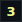

<a id="top"></a>
<!--
  you're reading the raw source. that's tty2 behavior. here's your prize:

  00000000  79 6f 75 20 66 6f 75 6e 64 20 74 74 79 32 2e 20
  00000010  6d 65 6e 74 69 6f 6e 20 41 52 54 45 4d 49 53 20
  00000020  77 68 65 6e 20 79 6f 75 20 65 6d 61 69 6c 20 6d
  00000030  65 20 61 6e 64 20 49 27 6c 6c 20 6b 6e 6f 77 20
  00000040  79 6f 75 20 72 65 61 64 20 74 68 65 20 73 6f 75
  00000050  72 63 65 2e

  (xxd -r if you must. also: cat .plan)
-->

<div align="center">
  <picture>
    <source media="(prefers-color-scheme: light)" srcset="./assets/safe-mode.svg">
    
  </picture>
</div>

<div align="center">

<!-- BOOT_ONELINER:START -->
`whitebox: 0 days since last spontaneous rewrite`
<!-- BOOT_ONELINER:END -->

</div>

<div align="center">
  
</div>

```text
  ▄▀█ █▀█ ▀█▀ ▀█ █▀▄▀█ ▄█ █▀   █▀█ █▀
  █▀█ █▀▄  █  ▄█ █ ▀ █  █ ▄█   █▄█ ▄█
  ──────────────────────────────────────
```

**Bill Zhang** · AI-first builder · hackathon operator · ships fast[^1]

<!-- MOTD:START -->
```text
$ cat /etc/motd
Current processes are running smoothly.
uptime: 4 years, 10 months (since 2021-09-21)
artemis.target: waxing gibbous (68% illuminated)
motd.d regenerated: 2026-07-23
```
<!-- MOTD:END -->

<div align="center">

 

</div>

> [!NOTE]
> Parts of this page are rewritten on a schedule by the machine itself — an LLM daemon, four cron jobs, and whatever you're about to do in the [fsck section](#-fsck-devsda1). The commit history is the changelog of a README editing itself.

## `$ ps aux --sort=-obsession`

<!-- CURRENTLY_BUILDING:START -->
| PID | %CPU | TIME | COMMAND |
| --: | --: | --: | :-- |
| 6853 | 95.0 | 16:13 | [`portfolio-v4 --update --merge`](https://github.com/IdkwhatImD0ing/PortfolioV4) |
| 1406 | 90.0 | 89:26 | [`hackathon-starter --open-pr --review`](https://github.com/IdkwhatImD0ing/hackathonstarterkit) |
| 5468 | 85.0 | 71:08 | `voice-ai --build --deploy` |
| 6233 | 80.0 | 116:53 | [`idkwhatimdoing --delete --push`](https://github.com/IdkwhatImD0ing/IdkwhatImD0ing) |
| 4776 | 75.0 | 99:36 | `hackathon-pitch --analyze --report` |
<!-- CURRENTLY_BUILDING:END -->

## `$ tail /var/log/hackathons.log`

<!-- HACKLOG:START -->
```text
$ grep -v '^#' /var/log/hackathons.log | tail -n 6
2023-02-04  GDSC Solution Challenge  [SHIP]  SlugLoop — Top 10 Global
2024-04-20  LA Hacks 2024  [WIN]  AdaptEd — Gemini Challenge 1st
2024-06-22  UC Berkeley AI Hackathon  [WIN]  DispatchAI — Grand Prize
2024-11-16  HackUTD 2024  [WIN]  TalkTuahBank — Overall 1st Place

$ grep -c '\[WIN\]' hackathons.log*
3
# log rotated — lifetime: 35 wins / 58 entered (source: the human)
```
<!-- HACKLOG:END -->

## `$ htop --user bill`

<div align="center">
  
  
</div>

<details>
<summary><code>$ render /var/cache/skyline.svg --3d</code></summary>
<div align="center">
  
</div>
</details>

## `$ fsck /dev/sda1`

<!-- FSCK:START -->
> [!CAUTION]
> **KERNEL PANIC** — sector C3 was corrupted and somebody scanned it anyway. board #2 is lost at 33/71 sectors verified. [requisition a fresh disk](https://github.com/IdkwhatImD0ing/IdkwhatImD0ing/issues/new?title=artemis%7Cfsck%7Creformat&body=Submit+this+issue+as-is+to+reformat+%2Fdev%2Fsda1+and+bring+up+a+fresh+board.%0AOnly+honored+when+the+current+board+is+panicked+or+cleaned%3B+the+daemon+refuses+mid-shift.) to reformat.

| | **A** | **B** | **C** | **D** | **E** | **F** | **G** | **H** | **I** |
|:-:|:-:|:-:|:-:|:-:|:-:|:-:|:-:|:-:|:-:|
| **1** |  |  |  |  |  |  |  |  |  |
| **2** |  |  |  |  |  |  |  |  |  |
| **3** |  |  |  |  |  |  |  |  |  |
| **4** |  |  |  |  |  |  |  |  |  |
| **5** |  |  |  |  |  |  |  |  |  |
| **6** |  |  |  |  |  |  |  |  |  |
| **7** |  |  |  |  |  |  |  |  |  |
| **8** |  |  |  |  |  |  |  |  |  |
| **9** |  |  |  |  |  |  |  |  |  |

<sub>scans are handled by a single-threaded fsck daemon: submitting an issue queues your scan, the eyes reaction means ack, and the board redraws about a minute later. refresh gently.</sub>

**S.M.A.R.T. log** — last 2 operation(s)

| operator | op | result |
|:--|:--|:--|
|  IdkwhatImD0ing | `fsck C3` | KERNEL PANIC |
|  IdkwhatImD0ing | `fsck E5` | sector clean |

| hall of fame — disks cleaned | hall of shame — kernel panics caused |
|:--|:--|
| *(vacant)* | 1. IdkwhatImD0ing ×1 |

<sub>ART3M1S accepts other commands. they are [not documented](https://github.com/IdkwhatImD0ing/IdkwhatImD0ing/issues/new?title=sudo+make+me+a+sandwich).</sub>
<!-- FSCK:END -->

## `$ ls -la ~/ships`

```text
total 58
drwxr-xr-x  bill  wheel   the good ones are below. the rest are
-rwx------  bill  wheel   hackathon dirs with 3am commit messages
```

| mode | ship | payload |
|:--|:--|:--|
| `-rwx r-- shipped` | [DispatchAI](https://github.com/IdkwhatImD0ing/DispatchAI) | AI copilot for overloaded 911 dispatch centers |
| `-rwx r-- shipped` | [TalkTuahBank](https://github.com/aurelisajuan/hackUTD) | voice-first banking for the people banks forgot |
| `-rwx r-- shipped` | [SlugLoop](https://github.com/SlugLoop/SlugLoop) | real-time campus bus tracker, UCSC-approved |
| `-rwx r-- shipped` | [AdaptEd](https://github.com/IdkwhatImD0ing/AdaptEd) | lectures that reshape themselves to the student |

<div align="center">

[](https://github.com/IdkwhatImD0ing/DispatchAI) [](https://github.com/aurelisajuan/hackUTD)
[](https://github.com/SlugLoop/SlugLoop) [](https://github.com/IdkwhatImD0ing/AdaptEd)

</div>

## `$ artemis-pkg list --explicit`

```text
typescript    5.x        (load-bearing)
python        3.12       (the other load-bearing one)
react         ∞          (cannot uninstall, dependency of everything)
next.js       latest     (see: react)
fastapi       latest     (default answer to most questions)
postgres      16         (where the state actually lives)
elevenlabs    hackathon-critical
pytorch       2.x        (installed for one weekend, kept forever)
ffmpeg        any        (do not ask what it is wired into)
tmux          -          (home)

warning: package 'sleep' is an optional dependency and is not installed
```

## `$ artemis-screensaver --idle 300`

<!-- SCREENSAVER:START -->
<div align="center">
  
</div>

`screensaver of the week: snake — a classic. the predator rotates. come back next week.`
<!-- SCREENSAVER:END -->

## `$ crontab -l`

<!-- CRONTAB:START -->
```text
# m h dom mon dow  command               comment
@reboot            artemis-ops.yaml      # on visitor input
9 13 * * 1,4       metrics.yaml          # repaint own dashboards
17 15 * * 1,4      profile-summary.yaml  # an LLM rewrites this page
23 7 * * 1         screensaver.yaml      # rotate the predator
41 14 * * 1        terminal-hero.yaml    # reroll boot (1-in-8: panic)
# the LLM's drafts go unreviewed. quality has improved.
# this machine stays alive by committing to itself. so can you.
```

<sub>daemon sources: [artemis-ops.yaml](.github/workflows/artemis-ops.yaml) · [metrics.yaml](.github/workflows/metrics.yaml) · [profile-summary.yaml](.github/workflows/profile-summary.yaml) · [screensaver.yaml](.github/workflows/screensaver.yaml) · [terminal-hero.yaml](.github/workflows/terminal-hero.yaml)</sub>
<!-- CRONTAB:END -->

## `$ mount /dev/peripherals`

<details>
<summary><code>lander.stl — ART3M1S descent module (drag to rotate, seriously)</code></summary>

```stl
solid artemis_lander
facet normal 0.000 0.749 0.662
 outer loop
  vertex 7.07 7.07 14.00
  vertex -7.07 7.07 14.00
  vertex 0.00 0.00 22.00
 endloop
endfacet
facet normal 0.000 0.749 -0.662
 outer loop
  vertex -7.07 7.07 14.00
  vertex 7.07 7.07 14.00
  vertex 0.00 0.00 6.00
 endloop
endfacet
facet normal -0.749 0.000 0.662
 outer loop
  vertex -7.07 7.07 14.00
  vertex -7.07 -7.07 14.00
  vertex 0.00 0.00 22.00
 endloop
endfacet
facet normal -0.749 0.000 -0.662
 outer loop
  vertex -7.07 -7.07 14.00
  vertex -7.07 7.07 14.00
  vertex 0.00 0.00 6.00
 endloop
endfacet
facet normal -0.000 -0.749 0.662
 outer loop
  vertex -7.07 -7.07 14.00
  vertex 7.07 -7.07 14.00
  vertex 0.00 0.00 22.00
 endloop
endfacet
facet normal -0.000 -0.749 -0.662
 outer loop
  vertex 7.07 -7.07 14.00
  vertex -7.07 -7.07 14.00
  vertex 0.00 0.00 6.00
 endloop
endfacet
facet normal 0.749 -0.000 0.662
 outer loop
  vertex 7.07 -7.07 14.00
  vertex 7.07 7.07 14.00
  vertex 0.00 0.00 22.00
 endloop
endfacet
facet normal 0.749 -0.000 -0.662
 outer loop
  vertex 7.07 7.07 14.00
  vertex 7.07 -7.07 14.00
  vertex 0.00 0.00 6.00
 endloop
endfacet
facet normal 0.000 0.000 1.000
 outer loop
  vertex -8.00 -8.00 10.00
  vertex 8.00 -8.00 10.00
  vertex 8.00 8.00 10.00
 endloop
endfacet
facet normal 0.000 0.000 1.000
 outer loop
  vertex -8.00 -8.00 10.00
  vertex 8.00 8.00 10.00
  vertex -8.00 8.00 10.00
 endloop
endfacet
facet normal 0.000 0.000 -1.000
 outer loop
  vertex -8.00 -8.00 6.00
  vertex -8.00 8.00 6.00
  vertex 8.00 8.00 6.00
 endloop
endfacet
facet normal 0.000 0.000 -1.000
 outer loop
  vertex -8.00 -8.00 6.00
  vertex 8.00 8.00 6.00
  vertex 8.00 -8.00 6.00
 endloop
endfacet
facet normal 0.000 -1.000 0.000
 outer loop
  vertex -8.00 -8.00 6.00
  vertex 8.00 -8.00 6.00
  vertex 8.00 -8.00 10.00
 endloop
endfacet
facet normal 0.000 -1.000 0.000
 outer loop
  vertex -8.00 -8.00 6.00
  vertex 8.00 -8.00 10.00
  vertex -8.00 -8.00 10.00
 endloop
endfacet
facet normal 1.000 0.000 0.000
 outer loop
  vertex 8.00 -8.00 6.00
  vertex 8.00 8.00 6.00
  vertex 8.00 8.00 10.00
 endloop
endfacet
facet normal 1.000 0.000 0.000
 outer loop
  vertex 8.00 -8.00 6.00
  vertex 8.00 8.00 10.00
  vertex 8.00 -8.00 10.00
 endloop
endfacet
facet normal 0.000 1.000 0.000
 outer loop
  vertex 8.00 8.00 6.00
  vertex -8.00 8.00 6.00
  vertex -8.00 8.00 10.00
 endloop
endfacet
facet normal 0.000 1.000 0.000
 outer loop
  vertex 8.00 8.00 6.00
  vertex -8.00 8.00 10.00
  vertex 8.00 8.00 10.00
 endloop
endfacet
facet normal -1.000 0.000 0.000
 outer loop
  vertex -8.00 8.00 6.00
  vertex -8.00 -8.00 6.00
  vertex -8.00 -8.00 10.00
 endloop
endfacet
facet normal -1.000 0.000 0.000
 outer loop
  vertex -8.00 8.00 6.00
  vertex -8.00 -8.00 10.00
  vertex -8.00 8.00 10.00
 endloop
endfacet
facet normal 0.000 0.753 0.659
 outer loop
  vertex 7.00 7.00 8.00
  vertex 14.00 14.00 0.00
  vertex 5.60 7.00 8.00
 endloop
endfacet
facet normal 0.753 0.000 0.659
 outer loop
  vertex 7.00 7.00 8.00
  vertex 7.00 5.60 8.00
  vertex 14.00 14.00 0.00
 endloop
endfacet
facet normal 0.000 0.000 1.000
 outer loop
  vertex 12.50 12.50 0.00
  vertex 15.50 12.50 0.00
  vertex 15.50 15.50 0.00
 endloop
endfacet
facet normal 0.000 0.000 1.000
 outer loop
  vertex 12.50 12.50 0.00
  vertex 15.50 15.50 0.00
  vertex 12.50 15.50 0.00
 endloop
endfacet
facet normal 0.000 0.753 -0.659
 outer loop
  vertex 7.00 -7.00 8.00
  vertex 14.00 -14.00 0.00
  vertex 5.60 -7.00 8.00
 endloop
endfacet
facet normal -0.753 0.000 -0.659
 outer loop
  vertex 7.00 -7.00 8.00
  vertex 7.00 -5.60 8.00
  vertex 14.00 -14.00 0.00
 endloop
endfacet
facet normal 0.000 0.000 1.000
 outer loop
  vertex 12.50 -15.50 0.00
  vertex 15.50 -15.50 0.00
  vertex 15.50 -12.50 0.00
 endloop
endfacet
facet normal 0.000 0.000 1.000
 outer loop
  vertex 12.50 -15.50 0.00
  vertex 15.50 -12.50 0.00
  vertex 12.50 -12.50 0.00
 endloop
endfacet
facet normal 0.000 -0.753 -0.659
 outer loop
  vertex -7.00 7.00 8.00
  vertex -14.00 14.00 0.00
  vertex -5.60 7.00 8.00
 endloop
endfacet
facet normal 0.753 0.000 -0.659
 outer loop
  vertex -7.00 7.00 8.00
  vertex -7.00 5.60 8.00
  vertex -14.00 14.00 0.00
 endloop
endfacet
facet normal 0.000 0.000 1.000
 outer loop
  vertex -15.50 12.50 0.00
  vertex -12.50 12.50 0.00
  vertex -12.50 15.50 0.00
 endloop
endfacet
facet normal 0.000 0.000 1.000
 outer loop
  vertex -15.50 12.50 0.00
  vertex -12.50 15.50 0.00
  vertex -15.50 15.50 0.00
 endloop
endfacet
facet normal 0.000 -0.753 0.659
 outer loop
  vertex -7.00 -7.00 8.00
  vertex -14.00 -14.00 0.00
  vertex -5.60 -7.00 8.00
 endloop
endfacet
facet normal -0.753 0.000 0.659
 outer loop
  vertex -7.00 -7.00 8.00
  vertex -7.00 -5.60 8.00
  vertex -14.00 -14.00 0.00
 endloop
endfacet
facet normal 0.000 0.000 1.000
 outer loop
  vertex -15.50 -15.50 0.00
  vertex -12.50 -15.50 0.00
  vertex -12.50 -12.50 0.00
 endloop
endfacet
facet normal 0.000 0.000 1.000
 outer loop
  vertex -15.50 -15.50 0.00
  vertex -12.50 -12.50 0.00
  vertex -15.50 -12.50 0.00
 endloop
endfacet
facet normal 0.000 -1.000 0.000
 outer loop
  vertex 0.00 0.00 22.00
  vertex 1.20 0.00 27.00
  vertex -1.20 0.00 27.00
 endloop
endfacet
facet normal 1.000 0.000 -0.000
 outer loop
  vertex 0.00 0.00 22.00
  vertex 0.00 1.20 27.00
  vertex 0.00 -1.20 27.00
 endloop
endfacet
endsolid artemis_lander
```

</details>

<details>
<summary><code>man bill — manual page for bill(1)</code></summary>

see [`man/bill.1.md`](./man/bill.1.md) — includes SYNOPSIS, EXIT STATUS, and a BUGS section legal made me keep.

</details>

## `$ tail /etc/passwd`

<!-- PASSWD:START -->
```text
$ tail -n 8 /etc/passwd
prakhxr0:x:1000:100:starred 2024-06-14:/home/prakhxr0:/usr/bin/zsh
# 1 user registered — star this repo to create your account.
```
<!-- PASSWD:END -->

## `$ nmap whitebox`

```text
PORT      STATE     SERVICE   NOTES
443/tcp   open      https     art3m1s.me — talk to my agent
80/tcp    open      http      thehackathonplaybook.dev
1337/tcp  open      card      see below
22/tcp    filtered  ssh       opens after you email first
```

This profile can leave your browser. Run this in your own terminal[^4]:

```sh
curl -sL https://raw.githubusercontent.com/IdkwhatImD0ing/IdkwhatImD0ing/main/bill.ansi
```

## `$ sudo shutdown -h now`

<div align="center">

[](https://art3m1s.me) [](https://linkedin.com/in/bill-zhang1) [](mailto:jzhang71@usc.edu)

[](https://discord.com/users/185544015314288641) [](https://www.youtube.com/@hackable-projects)

</div>

> [!CAUTION]
> This profile may spontaneously change topics, layouts, or opinions between visits. The maintainer considers this a feature and has declined to file a bug.

`currently cooking: ████████████ (announcement compiles itself)`

If you are building something ambitious, weird, AI-heavy, or demo-worthy, I probably want to hear about it.[^2]

<div align="center">

[ [`reboot`](#top) ] · [ [`view source`](https://github.com/IdkwhatImD0ing/IdkwhatImD0ing) ] · [ [`.plan`](./.plan) ]

<!-- BUILD_PLATE:START -->
<sub>compiled from `2e1e001` · build 29 · this page rebuilds itself; the human is a contributor</sub>
<!-- BUILD_PLATE:END -->

`Connection to whitebox closed.`

</div>

[^1]: "fast" is defined as demo-ready before the venue wifi fails.[^2]
[^2]: this footnote is load-bearing. removing it breaks footnote [^3].
[^3]: there is no footnote 3. you scrolled here anyway, which tells us both something.
[^4]: Windows: use `curl.exe`, not the PowerShell alias. you knew that. it's fine that you checked.
