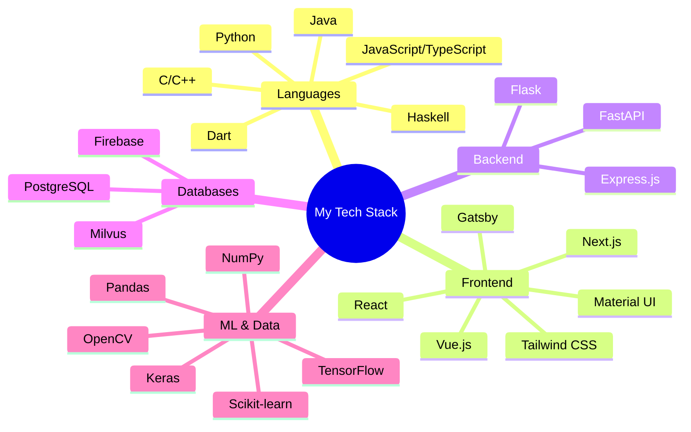
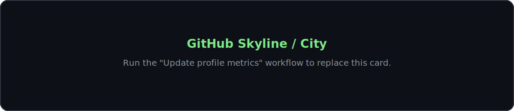
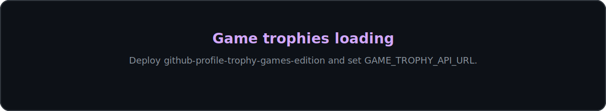

# Hey, I'm Bill Zhang (aka @IdkwhatImD0ing)

_Last updated: Apr 28 2026_

  

I build AI-first products, hackathon demos, and full-stack systems that are optimized for shipping fast without losing the plot.

## Currently Building

<!-- CURRENTLY_BUILDING:START -->
- Enhancing the IdkwhatImD0ing repository with new features and bug fixes.
- Developing the hackathonstarterkit to streamline project setups for hackathons.
- Updating PortfolioV3 to showcase recent projects and skills effectively.
- Writing guides on hackathon strategies and tools for non-coders.
- Experimenting with voice AI projects using ElevenLabs and Cursor.
<!-- CURRENTLY_BUILDING:END -->

## Featured Builds

## Daily Drivers

| Frontend | Backend | AI / Data |
|:--------:|:-------:|:---------:|
|  |  |  |

<b>Full technical arsenal</b>

```mermaid
mindmap
  root((My Tech Stack))
    Languages
      JavaScript/TypeScript
      Python
      Java
      C/C++
      Dart
      Haskell
    Frontend
      React
      Next.js
      Vue.js
      Gatsby
      Tailwind CSS
      Material UI
    Backend
      Express.js
      FastAPI
      Flask
    Databases
      PostgreSQL
      Firebase
      Milvus
    ML & Data
      TensorFlow
      Keras
      Pandas
      NumPy
      Scikit-learn
      OpenCV
```

## Profile Metrics

  
  
  
  

## Achievements

  

## Activity

  

## Let's Hack Together

If you are building something ambitious, weird, AI-heavy, or demo-worthy, I probably want to hear about it.

