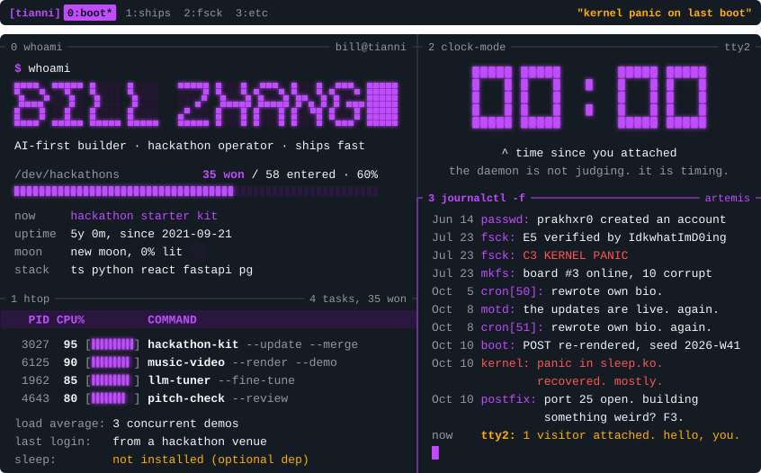
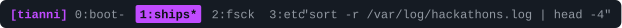
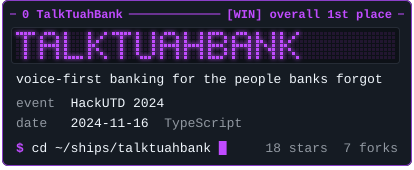
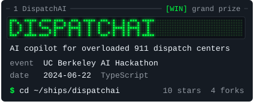
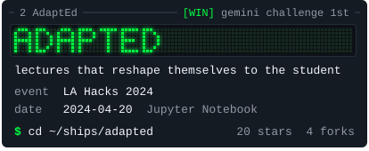
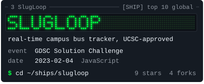
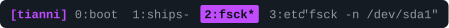
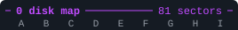
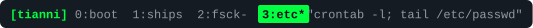

<a id="top"></a>
<!--
  you're reading the raw source. that's tty2 behavior. here's your prize:

  00000000  79 6f 75 20 66 6f 75 6e 64 20 74 74 79 32 2e 20
  00000010  6d 65 6e 74 69 6f 6e 20 41 52 54 45 4d 49 53 20
  00000020  77 68 65 6e 20 79 6f 75 20 65 6d 61 69 6c 20 6d
  00000030  65 20 61 6e 64 20 49 27 6c 6c 20 6b 6e 6f 77 20
  00000040  79 6f 75 20 72 65 61 64 20 74 68 65 20 73 6f 75
  00000050  72 63 65 2e

  (xxd -r if you must. also: cat .plan)

  the footnotes are gone. footnote 3 never existed.
  you checked anyway, which tells us both something.
-->

<p align="center"><picture><source media="(max-width: 600px), (min-width: 768px) and (max-width: 900px)" srcset="assets/hero-phone.svg"><source media="(prefers-color-scheme: light)" srcset="assets/hero-light.svg"></picture></p>

<p align="center"><a href="man/bill.1.md"><picture><source media="(max-width: 600px)" srcset="assets/chrome/key-f1.svg"><source media="(prefers-color-scheme: light)" srcset="assets/chrome/key-f1-light.svg"></picture></a><a href="https://art3m1s.me"><picture><source media="(max-width: 600px)" srcset="assets/chrome/key-f2.svg"><source media="(prefers-color-scheme: light)" srcset="assets/chrome/key-f2-light.svg"></picture></a><a href="mailto:jzhang71@usc.edu"><picture><source media="(max-width: 600px)" srcset="assets/chrome/key-f3.svg"><source media="(prefers-color-scheme: light)" srcset="assets/chrome/key-f3-light.svg"></picture></a><a href="https://linkedin.com/in/bill-zhang1"><picture><source media="(max-width: 600px)" srcset="assets/chrome/key-f4.svg"><source media="(prefers-color-scheme: light)" srcset="assets/chrome/key-f4-light.svg"></picture></a><a href="https://thehackathonplaybook.dev"><picture><source media="(max-width: 600px)" srcset="assets/chrome/key-f5.svg"><source media="(prefers-color-scheme: light)" srcset="assets/chrome/key-f5-light.svg"></picture></a><a href="https://www.youtube.com/@hackable-projects"><picture><source media="(max-width: 600px)" srcset="assets/chrome/key-f6.svg"><source media="(prefers-color-scheme: light)" srcset="assets/chrome/key-f6-light.svg"></picture></a><a href="https://discord.com/users/185544015314288641"><picture><source media="(max-width: 600px)" srcset="assets/chrome/key-f7.svg"><source media="(prefers-color-scheme: light)" srcset="assets/chrome/key-f7-light.svg"></picture></a></p>

<a id="ships"></a>
<p><a href="#fsck"><picture><source media="(max-width: 600px)" srcset="assets/chrome/bar-1-phone.svg"><source media="(prefers-color-scheme: light)" srcset="assets/chrome/bar-1-light.svg"></picture></a></p>

<!-- HACKLOG:START -->
<p align="center"><a href="https://github.com/aurelisajuan/TalkTuahBank"><picture><source media="(max-width: 600px)" srcset="assets/ships/talktuahbank-phone.svg"><source media="(prefers-color-scheme: light)" srcset="assets/ships/talktuahbank-light.svg"></picture></a><a href="https://github.com/IdkwhatImD0ing/DispatchAI"><picture><source media="(max-width: 600px)" srcset="assets/ships/dispatchai-phone.svg"><source media="(prefers-color-scheme: light)" srcset="assets/ships/dispatchai-light.svg"></picture></a><br>
<a href="https://github.com/IdkwhatImD0ing/AdaptEd"><picture><source media="(max-width: 600px)" srcset="assets/ships/adapted-phone.svg"><source media="(prefers-color-scheme: light)" srcset="assets/ships/adapted-light.svg"></picture></a><a href="https://github.com/SlugLoop/SlugLoop"><picture><source media="(max-width: 600px)" srcset="assets/ships/slugloop-phone.svg"><source media="(prefers-color-scheme: light)" srcset="assets/ships/slugloop-light.svg"></picture></a></p>
<!-- HACKLOG:END -->

<a id="fsck"></a>
<p><a href="#etc"><picture><source media="(max-width: 600px)" srcset="assets/chrome/bar-2-phone.svg"><source media="(prefers-color-scheme: light)" srcset="assets/chrome/bar-2-light.svg"></picture></a></p>

<!-- FSCK:START -->
<p>
<picture><source media="(max-width: 600px)" srcset="assets/fsck/panel-0-phone.svg"><source media="(prefers-color-scheme: light)" srcset="assets/fsck/panel-0-light.svg"></picture><picture><source media="(max-width: 600px)" srcset="assets/fsck/tiles/dark/cols.svg"><source media="(prefers-color-scheme: light)" srcset="assets/fsck/tiles/light/cols.svg"></picture><br>
<picture><source media="(max-width: 600px)" srcset="assets/fsck/tiles/dark/r1.svg"><source media="(prefers-color-scheme: light)" srcset="assets/fsck/tiles/light/r1.svg"></picture><a href="https://github.com/IdkwhatImD0ing/IdkwhatImD0ing/issues/new?title=artemis%7Cfsck%7CA1&amp;body=Submit+this+issue+as-is+to+scan+sector+A1+of+%2Fdev%2Fsda1.%0AThe+single-threaded+fsck+daemon+will+ack+with+an+eyes+reaction+and+redraw+the+board+in+about+a+minute."><picture><source media="(max-width: 600px)" srcset="assets/fsck/tiles/dark/hidden.svg"><source media="(prefers-color-scheme: light)" srcset="assets/fsck/tiles/light/hidden.svg"></picture></a><a href="https://github.com/IdkwhatImD0ing/IdkwhatImD0ing/issues/new?title=artemis%7Cfsck%7CB1&amp;body=Submit+this+issue+as-is+to+scan+sector+B1+of+%2Fdev%2Fsda1.%0AThe+single-threaded+fsck+daemon+will+ack+with+an+eyes+reaction+and+redraw+the+board+in+about+a+minute."><picture><source media="(max-width: 600px)" srcset="assets/fsck/tiles/dark/hidden.svg"><source media="(prefers-color-scheme: light)" srcset="assets/fsck/tiles/light/hidden.svg"></picture></a><a href="https://github.com/IdkwhatImD0ing/IdkwhatImD0ing/issues/new?title=artemis%7Cfsck%7CC1&amp;body=Submit+this+issue+as-is+to+scan+sector+C1+of+%2Fdev%2Fsda1.%0AThe+single-threaded+fsck+daemon+will+ack+with+an+eyes+reaction+and+redraw+the+board+in+about+a+minute."><picture><source media="(max-width: 600px)" srcset="assets/fsck/tiles/dark/hidden.svg"><source media="(prefers-color-scheme: light)" srcset="assets/fsck/tiles/light/hidden.svg"></picture></a><a href="https://github.com/IdkwhatImD0ing/IdkwhatImD0ing/issues/new?title=artemis%7Cfsck%7CD1&amp;body=Submit+this+issue+as-is+to+scan+sector+D1+of+%2Fdev%2Fsda1.%0AThe+single-threaded+fsck+daemon+will+ack+with+an+eyes+reaction+and+redraw+the+board+in+about+a+minute."><picture><source media="(max-width: 600px)" srcset="assets/fsck/tiles/dark/hidden.svg"><source media="(prefers-color-scheme: light)" srcset="assets/fsck/tiles/light/hidden.svg"></picture></a><a href="https://github.com/IdkwhatImD0ing/IdkwhatImD0ing/issues/new?title=artemis%7Cfsck%7CE1&amp;body=Submit+this+issue+as-is+to+scan+sector+E1+of+%2Fdev%2Fsda1.%0AThe+single-threaded+fsck+daemon+will+ack+with+an+eyes+reaction+and+redraw+the+board+in+about+a+minute."><picture><source media="(max-width: 600px)" srcset="assets/fsck/tiles/dark/hidden.svg"><source media="(prefers-color-scheme: light)" srcset="assets/fsck/tiles/light/hidden.svg"></picture></a><a href="https://github.com/IdkwhatImD0ing/IdkwhatImD0ing/issues/new?title=artemis%7Cfsck%7CF1&amp;body=Submit+this+issue+as-is+to+scan+sector+F1+of+%2Fdev%2Fsda1.%0AThe+single-threaded+fsck+daemon+will+ack+with+an+eyes+reaction+and+redraw+the+board+in+about+a+minute."><picture><source media="(max-width: 600px)" srcset="assets/fsck/tiles/dark/hidden.svg"><source media="(prefers-color-scheme: light)" srcset="assets/fsck/tiles/light/hidden.svg"></picture></a><a href="https://github.com/IdkwhatImD0ing/IdkwhatImD0ing/issues/new?title=artemis%7Cfsck%7CG1&amp;body=Submit+this+issue+as-is+to+scan+sector+G1+of+%2Fdev%2Fsda1.%0AThe+single-threaded+fsck+daemon+will+ack+with+an+eyes+reaction+and+redraw+the+board+in+about+a+minute."><picture><source media="(max-width: 600px)" srcset="assets/fsck/tiles/dark/hidden.svg"><source media="(prefers-color-scheme: light)" srcset="assets/fsck/tiles/light/hidden.svg"></picture></a><a href="https://github.com/IdkwhatImD0ing/IdkwhatImD0ing/issues/new?title=artemis%7Cfsck%7CH1&amp;body=Submit+this+issue+as-is+to+scan+sector+H1+of+%2Fdev%2Fsda1.%0AThe+single-threaded+fsck+daemon+will+ack+with+an+eyes+reaction+and+redraw+the+board+in+about+a+minute."><picture><source media="(max-width: 600px)" srcset="assets/fsck/tiles/dark/hidden.svg"><source media="(prefers-color-scheme: light)" srcset="assets/fsck/tiles/light/hidden.svg"></picture></a><a href="https://github.com/IdkwhatImD0ing/IdkwhatImD0ing/issues/new?title=artemis%7Cfsck%7CI1&amp;body=Submit+this+issue+as-is+to+scan+sector+I1+of+%2Fdev%2Fsda1.%0AThe+single-threaded+fsck+daemon+will+ack+with+an+eyes+reaction+and+redraw+the+board+in+about+a+minute."><picture><source media="(max-width: 600px)" srcset="assets/fsck/tiles/dark/hidden.svg"><source media="(prefers-color-scheme: light)" srcset="assets/fsck/tiles/light/hidden.svg"></picture></a><picture><source media="(max-width: 600px)" srcset="assets/fsck/tiles/dark/edge.svg"><source media="(prefers-color-scheme: light)" srcset="assets/fsck/tiles/light/edge.svg"></picture><br>
<picture><source media="(max-width: 600px)" srcset="assets/fsck/tiles/dark/r2.svg"><source media="(prefers-color-scheme: light)" srcset="assets/fsck/tiles/light/r2.svg"></picture><a href="https://github.com/IdkwhatImD0ing/IdkwhatImD0ing/issues/new?title=artemis%7Cfsck%7CA2&amp;body=Submit+this+issue+as-is+to+scan+sector+A2+of+%2Fdev%2Fsda1.%0AThe+single-threaded+fsck+daemon+will+ack+with+an+eyes+reaction+and+redraw+the+board+in+about+a+minute."><picture><source media="(max-width: 600px)" srcset="assets/fsck/tiles/dark/hidden.svg"><source media="(prefers-color-scheme: light)" srcset="assets/fsck/tiles/light/hidden.svg"></picture></a><a href="https://github.com/IdkwhatImD0ing/IdkwhatImD0ing/issues/new?title=artemis%7Cfsck%7CB2&amp;body=Submit+this+issue+as-is+to+scan+sector+B2+of+%2Fdev%2Fsda1.%0AThe+single-threaded+fsck+daemon+will+ack+with+an+eyes+reaction+and+redraw+the+board+in+about+a+minute."><picture><source media="(max-width: 600px)" srcset="assets/fsck/tiles/dark/hidden.svg"><source media="(prefers-color-scheme: light)" srcset="assets/fsck/tiles/light/hidden.svg"></picture></a><a href="https://github.com/IdkwhatImD0ing/IdkwhatImD0ing/issues/new?title=artemis%7Cfsck%7CC2&amp;body=Submit+this+issue+as-is+to+scan+sector+C2+of+%2Fdev%2Fsda1.%0AThe+single-threaded+fsck+daemon+will+ack+with+an+eyes+reaction+and+redraw+the+board+in+about+a+minute."><picture><source media="(max-width: 600px)" srcset="assets/fsck/tiles/dark/hidden.svg"><source media="(prefers-color-scheme: light)" srcset="assets/fsck/tiles/light/hidden.svg"></picture></a><a href="https://github.com/IdkwhatImD0ing/IdkwhatImD0ing/issues/new?title=artemis%7Cfsck%7CD2&amp;body=Submit+this+issue+as-is+to+scan+sector+D2+of+%2Fdev%2Fsda1.%0AThe+single-threaded+fsck+daemon+will+ack+with+an+eyes+reaction+and+redraw+the+board+in+about+a+minute."><picture><source media="(max-width: 600px)" srcset="assets/fsck/tiles/dark/hidden.svg"><source media="(prefers-color-scheme: light)" srcset="assets/fsck/tiles/light/hidden.svg"></picture></a><a href="https://github.com/IdkwhatImD0ing/IdkwhatImD0ing/issues/new?title=artemis%7Cfsck%7CE2&amp;body=Submit+this+issue+as-is+to+scan+sector+E2+of+%2Fdev%2Fsda1.%0AThe+single-threaded+fsck+daemon+will+ack+with+an+eyes+reaction+and+redraw+the+board+in+about+a+minute."><picture><source media="(max-width: 600px)" srcset="assets/fsck/tiles/dark/hidden.svg"><source media="(prefers-color-scheme: light)" srcset="assets/fsck/tiles/light/hidden.svg"></picture></a><a href="https://github.com/IdkwhatImD0ing/IdkwhatImD0ing/issues/new?title=artemis%7Cfsck%7CF2&amp;body=Submit+this+issue+as-is+to+scan+sector+F2+of+%2Fdev%2Fsda1.%0AThe+single-threaded+fsck+daemon+will+ack+with+an+eyes+reaction+and+redraw+the+board+in+about+a+minute."><picture><source media="(max-width: 600px)" srcset="assets/fsck/tiles/dark/hidden.svg"><source media="(prefers-color-scheme: light)" srcset="assets/fsck/tiles/light/hidden.svg"></picture></a><a href="https://github.com/IdkwhatImD0ing/IdkwhatImD0ing/issues/new?title=artemis%7Cfsck%7CG2&amp;body=Submit+this+issue+as-is+to+scan+sector+G2+of+%2Fdev%2Fsda1.%0AThe+single-threaded+fsck+daemon+will+ack+with+an+eyes+reaction+and+redraw+the+board+in+about+a+minute."><picture><source media="(max-width: 600px)" srcset="assets/fsck/tiles/dark/hidden.svg"><source media="(prefers-color-scheme: light)" srcset="assets/fsck/tiles/light/hidden.svg"></picture></a><a href="https://github.com/IdkwhatImD0ing/IdkwhatImD0ing/issues/new?title=artemis%7Cfsck%7CH2&amp;body=Submit+this+issue+as-is+to+scan+sector+H2+of+%2Fdev%2Fsda1.%0AThe+single-threaded+fsck+daemon+will+ack+with+an+eyes+reaction+and+redraw+the+board+in+about+a+minute."><picture><source media="(max-width: 600px)" srcset="assets/fsck/tiles/dark/hidden.svg"><source media="(prefers-color-scheme: light)" srcset="assets/fsck/tiles/light/hidden.svg"></picture></a><a href="https://github.com/IdkwhatImD0ing/IdkwhatImD0ing/issues/new?title=artemis%7Cfsck%7CI2&amp;body=Submit+this+issue+as-is+to+scan+sector+I2+of+%2Fdev%2Fsda1.%0AThe+single-threaded+fsck+daemon+will+ack+with+an+eyes+reaction+and+redraw+the+board+in+about+a+minute."><picture><source media="(max-width: 600px)" srcset="assets/fsck/tiles/dark/hidden.svg"><source media="(prefers-color-scheme: light)" srcset="assets/fsck/tiles/light/hidden.svg"></picture></a><picture><source media="(max-width: 600px)" srcset="assets/fsck/tiles/dark/edge.svg"><source media="(prefers-color-scheme: light)" srcset="assets/fsck/tiles/light/edge.svg"></picture><br>
<picture><source media="(max-width: 600px)" srcset="assets/fsck/tiles/dark/r3.svg"><source media="(prefers-color-scheme: light)" srcset="assets/fsck/tiles/light/r3.svg"></picture><a href="https://github.com/IdkwhatImD0ing/IdkwhatImD0ing/issues/new?title=artemis%7Cfsck%7CA3&amp;body=Submit+this+issue+as-is+to+scan+sector+A3+of+%2Fdev%2Fsda1.%0AThe+single-threaded+fsck+daemon+will+ack+with+an+eyes+reaction+and+redraw+the+board+in+about+a+minute."><picture><source media="(max-width: 600px)" srcset="assets/fsck/tiles/dark/hidden.svg"><source media="(prefers-color-scheme: light)" srcset="assets/fsck/tiles/light/hidden.svg"></picture></a><a href="https://github.com/IdkwhatImD0ing/IdkwhatImD0ing/issues/new?title=artemis%7Cfsck%7CB3&amp;body=Submit+this+issue+as-is+to+scan+sector+B3+of+%2Fdev%2Fsda1.%0AThe+single-threaded+fsck+daemon+will+ack+with+an+eyes+reaction+and+redraw+the+board+in+about+a+minute."><picture><source media="(max-width: 600px)" srcset="assets/fsck/tiles/dark/hidden.svg"><source media="(prefers-color-scheme: light)" srcset="assets/fsck/tiles/light/hidden.svg"></picture></a><a href="https://github.com/IdkwhatImD0ing/IdkwhatImD0ing/issues/new?title=artemis%7Cfsck%7CC3&amp;body=Submit+this+issue+as-is+to+scan+sector+C3+of+%2Fdev%2Fsda1.%0AThe+single-threaded+fsck+daemon+will+ack+with+an+eyes+reaction+and+redraw+the+board+in+about+a+minute."><picture><source media="(max-width: 600px)" srcset="assets/fsck/tiles/dark/hidden.svg"><source media="(prefers-color-scheme: light)" srcset="assets/fsck/tiles/light/hidden.svg"></picture></a><a href="https://github.com/IdkwhatImD0ing/IdkwhatImD0ing/issues/new?title=artemis%7Cfsck%7CD3&amp;body=Submit+this+issue+as-is+to+scan+sector+D3+of+%2Fdev%2Fsda1.%0AThe+single-threaded+fsck+daemon+will+ack+with+an+eyes+reaction+and+redraw+the+board+in+about+a+minute."><picture><source media="(max-width: 600px)" srcset="assets/fsck/tiles/dark/hidden.svg"><source media="(prefers-color-scheme: light)" srcset="assets/fsck/tiles/light/hidden.svg"></picture></a><a href="https://github.com/IdkwhatImD0ing/IdkwhatImD0ing/issues/new?title=artemis%7Cfsck%7CE3&amp;body=Submit+this+issue+as-is+to+scan+sector+E3+of+%2Fdev%2Fsda1.%0AThe+single-threaded+fsck+daemon+will+ack+with+an+eyes+reaction+and+redraw+the+board+in+about+a+minute."><picture><source media="(max-width: 600px)" srcset="assets/fsck/tiles/dark/hidden.svg"><source media="(prefers-color-scheme: light)" srcset="assets/fsck/tiles/light/hidden.svg"></picture></a><a href="https://github.com/IdkwhatImD0ing/IdkwhatImD0ing/issues/new?title=artemis%7Cfsck%7CF3&amp;body=Submit+this+issue+as-is+to+scan+sector+F3+of+%2Fdev%2Fsda1.%0AThe+single-threaded+fsck+daemon+will+ack+with+an+eyes+reaction+and+redraw+the+board+in+about+a+minute."><picture><source media="(max-width: 600px)" srcset="assets/fsck/tiles/dark/hidden.svg"><source media="(prefers-color-scheme: light)" srcset="assets/fsck/tiles/light/hidden.svg"></picture></a><a href="https://github.com/IdkwhatImD0ing/IdkwhatImD0ing/issues/new?title=artemis%7Cfsck%7CG3&amp;body=Submit+this+issue+as-is+to+scan+sector+G3+of+%2Fdev%2Fsda1.%0AThe+single-threaded+fsck+daemon+will+ack+with+an+eyes+reaction+and+redraw+the+board+in+about+a+minute."><picture><source media="(max-width: 600px)" srcset="assets/fsck/tiles/dark/hidden.svg"><source media="(prefers-color-scheme: light)" srcset="assets/fsck/tiles/light/hidden.svg"></picture></a><a href="https://github.com/IdkwhatImD0ing/IdkwhatImD0ing/issues/new?title=artemis%7Cfsck%7CH3&amp;body=Submit+this+issue+as-is+to+scan+sector+H3+of+%2Fdev%2Fsda1.%0AThe+single-threaded+fsck+daemon+will+ack+with+an+eyes+reaction+and+redraw+the+board+in+about+a+minute."><picture><source media="(max-width: 600px)" srcset="assets/fsck/tiles/dark/hidden.svg"><source media="(prefers-color-scheme: light)" srcset="assets/fsck/tiles/light/hidden.svg"></picture></a><a href="https://github.com/IdkwhatImD0ing/IdkwhatImD0ing/issues/new?title=artemis%7Cfsck%7CI3&amp;body=Submit+this+issue+as-is+to+scan+sector+I3+of+%2Fdev%2Fsda1.%0AThe+single-threaded+fsck+daemon+will+ack+with+an+eyes+reaction+and+redraw+the+board+in+about+a+minute."><picture><source media="(max-width: 600px)" srcset="assets/fsck/tiles/dark/hidden.svg"><source media="(prefers-color-scheme: light)" srcset="assets/fsck/tiles/light/hidden.svg"></picture></a><picture><source media="(max-width: 600px)" srcset="assets/fsck/tiles/dark/edge.svg"><source media="(prefers-color-scheme: light)" srcset="assets/fsck/tiles/light/edge.svg"></picture><br>
<picture><source media="(max-width: 600px)" srcset="assets/fsck/tiles/dark/r4.svg"><source media="(prefers-color-scheme: light)" srcset="assets/fsck/tiles/light/r4.svg"></picture><a href="https://github.com/IdkwhatImD0ing/IdkwhatImD0ing/issues/new?title=artemis%7Cfsck%7CA4&amp;body=Submit+this+issue+as-is+to+scan+sector+A4+of+%2Fdev%2Fsda1.%0AThe+single-threaded+fsck+daemon+will+ack+with+an+eyes+reaction+and+redraw+the+board+in+about+a+minute."><picture><source media="(max-width: 600px)" srcset="assets/fsck/tiles/dark/hidden.svg"><source media="(prefers-color-scheme: light)" srcset="assets/fsck/tiles/light/hidden.svg"></picture></a><a href="https://github.com/IdkwhatImD0ing/IdkwhatImD0ing/issues/new?title=artemis%7Cfsck%7CB4&amp;body=Submit+this+issue+as-is+to+scan+sector+B4+of+%2Fdev%2Fsda1.%0AThe+single-threaded+fsck+daemon+will+ack+with+an+eyes+reaction+and+redraw+the+board+in+about+a+minute."><picture><source media="(max-width: 600px)" srcset="assets/fsck/tiles/dark/hidden.svg"><source media="(prefers-color-scheme: light)" srcset="assets/fsck/tiles/light/hidden.svg"></picture></a><a href="https://github.com/IdkwhatImD0ing/IdkwhatImD0ing/issues/new?title=artemis%7Cfsck%7CC4&amp;body=Submit+this+issue+as-is+to+scan+sector+C4+of+%2Fdev%2Fsda1.%0AThe+single-threaded+fsck+daemon+will+ack+with+an+eyes+reaction+and+redraw+the+board+in+about+a+minute."><picture><source media="(max-width: 600px)" srcset="assets/fsck/tiles/dark/hidden.svg"><source media="(prefers-color-scheme: light)" srcset="assets/fsck/tiles/light/hidden.svg"></picture></a><a href="https://github.com/IdkwhatImD0ing/IdkwhatImD0ing/issues/new?title=artemis%7Cfsck%7CD4&amp;body=Submit+this+issue+as-is+to+scan+sector+D4+of+%2Fdev%2Fsda1.%0AThe+single-threaded+fsck+daemon+will+ack+with+an+eyes+reaction+and+redraw+the+board+in+about+a+minute."><picture><source media="(max-width: 600px)" srcset="assets/fsck/tiles/dark/hidden.svg"><source media="(prefers-color-scheme: light)" srcset="assets/fsck/tiles/light/hidden.svg"></picture></a><a href="https://github.com/IdkwhatImD0ing/IdkwhatImD0ing/issues/new?title=artemis%7Cfsck%7CE4&amp;body=Submit+this+issue+as-is+to+scan+sector+E4+of+%2Fdev%2Fsda1.%0AThe+single-threaded+fsck+daemon+will+ack+with+an+eyes+reaction+and+redraw+the+board+in+about+a+minute."><picture><source media="(max-width: 600px)" srcset="assets/fsck/tiles/dark/hidden.svg"><source media="(prefers-color-scheme: light)" srcset="assets/fsck/tiles/light/hidden.svg"></picture></a><a href="https://github.com/IdkwhatImD0ing/IdkwhatImD0ing/issues/new?title=artemis%7Cfsck%7CF4&amp;body=Submit+this+issue+as-is+to+scan+sector+F4+of+%2Fdev%2Fsda1.%0AThe+single-threaded+fsck+daemon+will+ack+with+an+eyes+reaction+and+redraw+the+board+in+about+a+minute."><picture><source media="(max-width: 600px)" srcset="assets/fsck/tiles/dark/hidden.svg"><source media="(prefers-color-scheme: light)" srcset="assets/fsck/tiles/light/hidden.svg"></picture></a><a href="https://github.com/IdkwhatImD0ing/IdkwhatImD0ing/issues/new?title=artemis%7Cfsck%7CG4&amp;body=Submit+this+issue+as-is+to+scan+sector+G4+of+%2Fdev%2Fsda1.%0AThe+single-threaded+fsck+daemon+will+ack+with+an+eyes+reaction+and+redraw+the+board+in+about+a+minute."><picture><source media="(max-width: 600px)" srcset="assets/fsck/tiles/dark/hidden.svg"><source media="(prefers-color-scheme: light)" srcset="assets/fsck/tiles/light/hidden.svg"></picture></a><a href="https://github.com/IdkwhatImD0ing/IdkwhatImD0ing/issues/new?title=artemis%7Cfsck%7CH4&amp;body=Submit+this+issue+as-is+to+scan+sector+H4+of+%2Fdev%2Fsda1.%0AThe+single-threaded+fsck+daemon+will+ack+with+an+eyes+reaction+and+redraw+the+board+in+about+a+minute."><picture><source media="(max-width: 600px)" srcset="assets/fsck/tiles/dark/hidden.svg"><source media="(prefers-color-scheme: light)" srcset="assets/fsck/tiles/light/hidden.svg"></picture></a><a href="https://github.com/IdkwhatImD0ing/IdkwhatImD0ing/issues/new?title=artemis%7Cfsck%7CI4&amp;body=Submit+this+issue+as-is+to+scan+sector+I4+of+%2Fdev%2Fsda1.%0AThe+single-threaded+fsck+daemon+will+ack+with+an+eyes+reaction+and+redraw+the+board+in+about+a+minute."><picture><source media="(max-width: 600px)" srcset="assets/fsck/tiles/dark/hidden.svg"><source media="(prefers-color-scheme: light)" srcset="assets/fsck/tiles/light/hidden.svg"></picture></a><picture><source media="(max-width: 600px)" srcset="assets/fsck/tiles/dark/edge.svg"><source media="(prefers-color-scheme: light)" srcset="assets/fsck/tiles/light/edge.svg"></picture><br>
<picture><source media="(max-width: 600px)" srcset="assets/fsck/tiles/dark/r5.svg"><source media="(prefers-color-scheme: light)" srcset="assets/fsck/tiles/light/r5.svg"></picture><a href="https://github.com/IdkwhatImD0ing/IdkwhatImD0ing/issues/new?title=artemis%7Cfsck%7CA5&amp;body=Submit+this+issue+as-is+to+scan+sector+A5+of+%2Fdev%2Fsda1.%0AThe+single-threaded+fsck+daemon+will+ack+with+an+eyes+reaction+and+redraw+the+board+in+about+a+minute."><picture><source media="(max-width: 600px)" srcset="assets/fsck/tiles/dark/hidden.svg"><source media="(prefers-color-scheme: light)" srcset="assets/fsck/tiles/light/hidden.svg"></picture></a><a href="https://github.com/IdkwhatImD0ing/IdkwhatImD0ing/issues/new?title=artemis%7Cfsck%7CB5&amp;body=Submit+this+issue+as-is+to+scan+sector+B5+of+%2Fdev%2Fsda1.%0AThe+single-threaded+fsck+daemon+will+ack+with+an+eyes+reaction+and+redraw+the+board+in+about+a+minute."><picture><source media="(max-width: 600px)" srcset="assets/fsck/tiles/dark/hidden.svg"><source media="(prefers-color-scheme: light)" srcset="assets/fsck/tiles/light/hidden.svg"></picture></a><a href="https://github.com/IdkwhatImD0ing/IdkwhatImD0ing/issues/new?title=artemis%7Cfsck%7CC5&amp;body=Submit+this+issue+as-is+to+scan+sector+C5+of+%2Fdev%2Fsda1.%0AThe+single-threaded+fsck+daemon+will+ack+with+an+eyes+reaction+and+redraw+the+board+in+about+a+minute."><picture><source media="(max-width: 600px)" srcset="assets/fsck/tiles/dark/hidden.svg"><source media="(prefers-color-scheme: light)" srcset="assets/fsck/tiles/light/hidden.svg"></picture></a><a href="https://github.com/IdkwhatImD0ing/IdkwhatImD0ing/issues/new?title=artemis%7Cfsck%7CD5&amp;body=Submit+this+issue+as-is+to+scan+sector+D5+of+%2Fdev%2Fsda1.%0AThe+single-threaded+fsck+daemon+will+ack+with+an+eyes+reaction+and+redraw+the+board+in+about+a+minute."><picture><source media="(max-width: 600px)" srcset="assets/fsck/tiles/dark/hidden.svg"><source media="(prefers-color-scheme: light)" srcset="assets/fsck/tiles/light/hidden.svg"></picture></a><a href="https://github.com/IdkwhatImD0ing/IdkwhatImD0ing/issues/new?title=artemis%7Cfsck%7CE5&amp;body=Submit+this+issue+as-is+to+scan+sector+E5+of+%2Fdev%2Fsda1.%0AThe+single-threaded+fsck+daemon+will+ack+with+an+eyes+reaction+and+redraw+the+board+in+about+a+minute."><picture><source media="(max-width: 600px)" srcset="assets/fsck/tiles/dark/hidden.svg"><source media="(prefers-color-scheme: light)" srcset="assets/fsck/tiles/light/hidden.svg"></picture></a><a href="https://github.com/IdkwhatImD0ing/IdkwhatImD0ing/issues/new?title=artemis%7Cfsck%7CF5&amp;body=Submit+this+issue+as-is+to+scan+sector+F5+of+%2Fdev%2Fsda1.%0AThe+single-threaded+fsck+daemon+will+ack+with+an+eyes+reaction+and+redraw+the+board+in+about+a+minute."><picture><source media="(max-width: 600px)" srcset="assets/fsck/tiles/dark/hidden.svg"><source media="(prefers-color-scheme: light)" srcset="assets/fsck/tiles/light/hidden.svg"></picture></a><a href="https://github.com/IdkwhatImD0ing/IdkwhatImD0ing/issues/new?title=artemis%7Cfsck%7CG5&amp;body=Submit+this+issue+as-is+to+scan+sector+G5+of+%2Fdev%2Fsda1.%0AThe+single-threaded+fsck+daemon+will+ack+with+an+eyes+reaction+and+redraw+the+board+in+about+a+minute."><picture><source media="(max-width: 600px)" srcset="assets/fsck/tiles/dark/hidden.svg"><source media="(prefers-color-scheme: light)" srcset="assets/fsck/tiles/light/hidden.svg"></picture></a><a href="https://github.com/IdkwhatImD0ing/IdkwhatImD0ing/issues/new?title=artemis%7Cfsck%7CH5&amp;body=Submit+this+issue+as-is+to+scan+sector+H5+of+%2Fdev%2Fsda1.%0AThe+single-threaded+fsck+daemon+will+ack+with+an+eyes+reaction+and+redraw+the+board+in+about+a+minute."><picture><source media="(max-width: 600px)" srcset="assets/fsck/tiles/dark/hidden.svg"><source media="(prefers-color-scheme: light)" srcset="assets/fsck/tiles/light/hidden.svg"></picture></a><a href="https://github.com/IdkwhatImD0ing/IdkwhatImD0ing/issues/new?title=artemis%7Cfsck%7CI5&amp;body=Submit+this+issue+as-is+to+scan+sector+I5+of+%2Fdev%2Fsda1.%0AThe+single-threaded+fsck+daemon+will+ack+with+an+eyes+reaction+and+redraw+the+board+in+about+a+minute."><picture><source media="(max-width: 600px)" srcset="assets/fsck/tiles/dark/hidden.svg"><source media="(prefers-color-scheme: light)" srcset="assets/fsck/tiles/light/hidden.svg"></picture></a><picture><source media="(max-width: 600px)" srcset="assets/fsck/tiles/dark/edge.svg"><source media="(prefers-color-scheme: light)" srcset="assets/fsck/tiles/light/edge.svg"></picture><br>
<picture><source media="(max-width: 600px)" srcset="assets/fsck/tiles/dark/r6.svg"><source media="(prefers-color-scheme: light)" srcset="assets/fsck/tiles/light/r6.svg"></picture><a href="https://github.com/IdkwhatImD0ing/IdkwhatImD0ing/issues/new?title=artemis%7Cfsck%7CA6&amp;body=Submit+this+issue+as-is+to+scan+sector+A6+of+%2Fdev%2Fsda1.%0AThe+single-threaded+fsck+daemon+will+ack+with+an+eyes+reaction+and+redraw+the+board+in+about+a+minute."><picture><source media="(max-width: 600px)" srcset="assets/fsck/tiles/dark/hidden.svg"><source media="(prefers-color-scheme: light)" srcset="assets/fsck/tiles/light/hidden.svg"></picture></a><a href="https://github.com/IdkwhatImD0ing/IdkwhatImD0ing/issues/new?title=artemis%7Cfsck%7CB6&amp;body=Submit+this+issue+as-is+to+scan+sector+B6+of+%2Fdev%2Fsda1.%0AThe+single-threaded+fsck+daemon+will+ack+with+an+eyes+reaction+and+redraw+the+board+in+about+a+minute."><picture><source media="(max-width: 600px)" srcset="assets/fsck/tiles/dark/hidden.svg"><source media="(prefers-color-scheme: light)" srcset="assets/fsck/tiles/light/hidden.svg"></picture></a><a href="https://github.com/IdkwhatImD0ing/IdkwhatImD0ing/issues/new?title=artemis%7Cfsck%7CC6&amp;body=Submit+this+issue+as-is+to+scan+sector+C6+of+%2Fdev%2Fsda1.%0AThe+single-threaded+fsck+daemon+will+ack+with+an+eyes+reaction+and+redraw+the+board+in+about+a+minute."><picture><source media="(max-width: 600px)" srcset="assets/fsck/tiles/dark/hidden.svg"><source media="(prefers-color-scheme: light)" srcset="assets/fsck/tiles/light/hidden.svg"></picture></a><a href="https://github.com/IdkwhatImD0ing/IdkwhatImD0ing/issues/new?title=artemis%7Cfsck%7CD6&amp;body=Submit+this+issue+as-is+to+scan+sector+D6+of+%2Fdev%2Fsda1.%0AThe+single-threaded+fsck+daemon+will+ack+with+an+eyes+reaction+and+redraw+the+board+in+about+a+minute."><picture><source media="(max-width: 600px)" srcset="assets/fsck/tiles/dark/hidden.svg"><source media="(prefers-color-scheme: light)" srcset="assets/fsck/tiles/light/hidden.svg"></picture></a><a href="https://github.com/IdkwhatImD0ing/IdkwhatImD0ing/issues/new?title=artemis%7Cfsck%7CE6&amp;body=Submit+this+issue+as-is+to+scan+sector+E6+of+%2Fdev%2Fsda1.%0AThe+single-threaded+fsck+daemon+will+ack+with+an+eyes+reaction+and+redraw+the+board+in+about+a+minute."><picture><source media="(max-width: 600px)" srcset="assets/fsck/tiles/dark/hidden.svg"><source media="(prefers-color-scheme: light)" srcset="assets/fsck/tiles/light/hidden.svg"></picture></a><a href="https://github.com/IdkwhatImD0ing/IdkwhatImD0ing/issues/new?title=artemis%7Cfsck%7CF6&amp;body=Submit+this+issue+as-is+to+scan+sector+F6+of+%2Fdev%2Fsda1.%0AThe+single-threaded+fsck+daemon+will+ack+with+an+eyes+reaction+and+redraw+the+board+in+about+a+minute."><picture><source media="(max-width: 600px)" srcset="assets/fsck/tiles/dark/hidden.svg"><source media="(prefers-color-scheme: light)" srcset="assets/fsck/tiles/light/hidden.svg"></picture></a><a href="https://github.com/IdkwhatImD0ing/IdkwhatImD0ing/issues/new?title=artemis%7Cfsck%7CG6&amp;body=Submit+this+issue+as-is+to+scan+sector+G6+of+%2Fdev%2Fsda1.%0AThe+single-threaded+fsck+daemon+will+ack+with+an+eyes+reaction+and+redraw+the+board+in+about+a+minute."><picture><source media="(max-width: 600px)" srcset="assets/fsck/tiles/dark/hidden.svg"><source media="(prefers-color-scheme: light)" srcset="assets/fsck/tiles/light/hidden.svg"></picture></a><a href="https://github.com/IdkwhatImD0ing/IdkwhatImD0ing/issues/new?title=artemis%7Cfsck%7CH6&amp;body=Submit+this+issue+as-is+to+scan+sector+H6+of+%2Fdev%2Fsda1.%0AThe+single-threaded+fsck+daemon+will+ack+with+an+eyes+reaction+and+redraw+the+board+in+about+a+minute."><picture><source media="(max-width: 600px)" srcset="assets/fsck/tiles/dark/hidden.svg"><source media="(prefers-color-scheme: light)" srcset="assets/fsck/tiles/light/hidden.svg"></picture></a><a href="https://github.com/IdkwhatImD0ing/IdkwhatImD0ing/issues/new?title=artemis%7Cfsck%7CI6&amp;body=Submit+this+issue+as-is+to+scan+sector+I6+of+%2Fdev%2Fsda1.%0AThe+single-threaded+fsck+daemon+will+ack+with+an+eyes+reaction+and+redraw+the+board+in+about+a+minute."><picture><source media="(max-width: 600px)" srcset="assets/fsck/tiles/dark/hidden.svg"><source media="(prefers-color-scheme: light)" srcset="assets/fsck/tiles/light/hidden.svg"></picture></a><picture><source media="(max-width: 600px)" srcset="assets/fsck/tiles/dark/edge.svg"><source media="(prefers-color-scheme: light)" srcset="assets/fsck/tiles/light/edge.svg"></picture><br>
<picture><source media="(max-width: 600px)" srcset="assets/fsck/tiles/dark/r7.svg"><source media="(prefers-color-scheme: light)" srcset="assets/fsck/tiles/light/r7.svg"></picture><a href="https://github.com/IdkwhatImD0ing/IdkwhatImD0ing/issues/new?title=artemis%7Cfsck%7CA7&amp;body=Submit+this+issue+as-is+to+scan+sector+A7+of+%2Fdev%2Fsda1.%0AThe+single-threaded+fsck+daemon+will+ack+with+an+eyes+reaction+and+redraw+the+board+in+about+a+minute."><picture><source media="(max-width: 600px)" srcset="assets/fsck/tiles/dark/hidden.svg"><source media="(prefers-color-scheme: light)" srcset="assets/fsck/tiles/light/hidden.svg"></picture></a><a href="https://github.com/IdkwhatImD0ing/IdkwhatImD0ing/issues/new?title=artemis%7Cfsck%7CB7&amp;body=Submit+this+issue+as-is+to+scan+sector+B7+of+%2Fdev%2Fsda1.%0AThe+single-threaded+fsck+daemon+will+ack+with+an+eyes+reaction+and+redraw+the+board+in+about+a+minute."><picture><source media="(max-width: 600px)" srcset="assets/fsck/tiles/dark/hidden.svg"><source media="(prefers-color-scheme: light)" srcset="assets/fsck/tiles/light/hidden.svg"></picture></a><a href="https://github.com/IdkwhatImD0ing/IdkwhatImD0ing/issues/new?title=artemis%7Cfsck%7CC7&amp;body=Submit+this+issue+as-is+to+scan+sector+C7+of+%2Fdev%2Fsda1.%0AThe+single-threaded+fsck+daemon+will+ack+with+an+eyes+reaction+and+redraw+the+board+in+about+a+minute."><picture><source media="(max-width: 600px)" srcset="assets/fsck/tiles/dark/hidden.svg"><source media="(prefers-color-scheme: light)" srcset="assets/fsck/tiles/light/hidden.svg"></picture></a><a href="https://github.com/IdkwhatImD0ing/IdkwhatImD0ing/issues/new?title=artemis%7Cfsck%7CD7&amp;body=Submit+this+issue+as-is+to+scan+sector+D7+of+%2Fdev%2Fsda1.%0AThe+single-threaded+fsck+daemon+will+ack+with+an+eyes+reaction+and+redraw+the+board+in+about+a+minute."><picture><source media="(max-width: 600px)" srcset="assets/fsck/tiles/dark/hidden.svg"><source media="(prefers-color-scheme: light)" srcset="assets/fsck/tiles/light/hidden.svg"></picture></a><a href="https://github.com/IdkwhatImD0ing/IdkwhatImD0ing/issues/new?title=artemis%7Cfsck%7CE7&amp;body=Submit+this+issue+as-is+to+scan+sector+E7+of+%2Fdev%2Fsda1.%0AThe+single-threaded+fsck+daemon+will+ack+with+an+eyes+reaction+and+redraw+the+board+in+about+a+minute."><picture><source media="(max-width: 600px)" srcset="assets/fsck/tiles/dark/hidden.svg"><source media="(prefers-color-scheme: light)" srcset="assets/fsck/tiles/light/hidden.svg"></picture></a><a href="https://github.com/IdkwhatImD0ing/IdkwhatImD0ing/issues/new?title=artemis%7Cfsck%7CF7&amp;body=Submit+this+issue+as-is+to+scan+sector+F7+of+%2Fdev%2Fsda1.%0AThe+single-threaded+fsck+daemon+will+ack+with+an+eyes+reaction+and+redraw+the+board+in+about+a+minute."><picture><source media="(max-width: 600px)" srcset="assets/fsck/tiles/dark/hidden.svg"><source media="(prefers-color-scheme: light)" srcset="assets/fsck/tiles/light/hidden.svg"></picture></a><a href="https://github.com/IdkwhatImD0ing/IdkwhatImD0ing/issues/new?title=artemis%7Cfsck%7CG7&amp;body=Submit+this+issue+as-is+to+scan+sector+G7+of+%2Fdev%2Fsda1.%0AThe+single-threaded+fsck+daemon+will+ack+with+an+eyes+reaction+and+redraw+the+board+in+about+a+minute."><picture><source media="(max-width: 600px)" srcset="assets/fsck/tiles/dark/hidden.svg"><source media="(prefers-color-scheme: light)" srcset="assets/fsck/tiles/light/hidden.svg"></picture></a><a href="https://github.com/IdkwhatImD0ing/IdkwhatImD0ing/issues/new?title=artemis%7Cfsck%7CH7&amp;body=Submit+this+issue+as-is+to+scan+sector+H7+of+%2Fdev%2Fsda1.%0AThe+single-threaded+fsck+daemon+will+ack+with+an+eyes+reaction+and+redraw+the+board+in+about+a+minute."><picture><source media="(max-width: 600px)" srcset="assets/fsck/tiles/dark/hidden.svg"><source media="(prefers-color-scheme: light)" srcset="assets/fsck/tiles/light/hidden.svg"></picture></a><a href="https://github.com/IdkwhatImD0ing/IdkwhatImD0ing/issues/new?title=artemis%7Cfsck%7CI7&amp;body=Submit+this+issue+as-is+to+scan+sector+I7+of+%2Fdev%2Fsda1.%0AThe+single-threaded+fsck+daemon+will+ack+with+an+eyes+reaction+and+redraw+the+board+in+about+a+minute."><picture><source media="(max-width: 600px)" srcset="assets/fsck/tiles/dark/hidden.svg"><source media="(prefers-color-scheme: light)" srcset="assets/fsck/tiles/light/hidden.svg"></picture></a><picture><source media="(max-width: 600px)" srcset="assets/fsck/tiles/dark/edge.svg"><source media="(prefers-color-scheme: light)" srcset="assets/fsck/tiles/light/edge.svg"></picture><br>
<picture><source media="(max-width: 600px)" srcset="assets/fsck/tiles/dark/r8.svg"><source media="(prefers-color-scheme: light)" srcset="assets/fsck/tiles/light/r8.svg"></picture><a href="https://github.com/IdkwhatImD0ing/IdkwhatImD0ing/issues/new?title=artemis%7Cfsck%7CA8&amp;body=Submit+this+issue+as-is+to+scan+sector+A8+of+%2Fdev%2Fsda1.%0AThe+single-threaded+fsck+daemon+will+ack+with+an+eyes+reaction+and+redraw+the+board+in+about+a+minute."><picture><source media="(max-width: 600px)" srcset="assets/fsck/tiles/dark/hidden.svg"><source media="(prefers-color-scheme: light)" srcset="assets/fsck/tiles/light/hidden.svg"></picture></a><a href="https://github.com/IdkwhatImD0ing/IdkwhatImD0ing/issues/new?title=artemis%7Cfsck%7CB8&amp;body=Submit+this+issue+as-is+to+scan+sector+B8+of+%2Fdev%2Fsda1.%0AThe+single-threaded+fsck+daemon+will+ack+with+an+eyes+reaction+and+redraw+the+board+in+about+a+minute."><picture><source media="(max-width: 600px)" srcset="assets/fsck/tiles/dark/hidden.svg"><source media="(prefers-color-scheme: light)" srcset="assets/fsck/tiles/light/hidden.svg"></picture></a><a href="https://github.com/IdkwhatImD0ing/IdkwhatImD0ing/issues/new?title=artemis%7Cfsck%7CC8&amp;body=Submit+this+issue+as-is+to+scan+sector+C8+of+%2Fdev%2Fsda1.%0AThe+single-threaded+fsck+daemon+will+ack+with+an+eyes+reaction+and+redraw+the+board+in+about+a+minute."><picture><source media="(max-width: 600px)" srcset="assets/fsck/tiles/dark/hidden.svg"><source media="(prefers-color-scheme: light)" srcset="assets/fsck/tiles/light/hidden.svg"></picture></a><a href="https://github.com/IdkwhatImD0ing/IdkwhatImD0ing/issues/new?title=artemis%7Cfsck%7CD8&amp;body=Submit+this+issue+as-is+to+scan+sector+D8+of+%2Fdev%2Fsda1.%0AThe+single-threaded+fsck+daemon+will+ack+with+an+eyes+reaction+and+redraw+the+board+in+about+a+minute."><picture><source media="(max-width: 600px)" srcset="assets/fsck/tiles/dark/hidden.svg"><source media="(prefers-color-scheme: light)" srcset="assets/fsck/tiles/light/hidden.svg"></picture></a><a href="https://github.com/IdkwhatImD0ing/IdkwhatImD0ing/issues/new?title=artemis%7Cfsck%7CE8&amp;body=Submit+this+issue+as-is+to+scan+sector+E8+of+%2Fdev%2Fsda1.%0AThe+single-threaded+fsck+daemon+will+ack+with+an+eyes+reaction+and+redraw+the+board+in+about+a+minute."><picture><source media="(max-width: 600px)" srcset="assets/fsck/tiles/dark/hidden.svg"><source media="(prefers-color-scheme: light)" srcset="assets/fsck/tiles/light/hidden.svg"></picture></a><a href="https://github.com/IdkwhatImD0ing/IdkwhatImD0ing/issues/new?title=artemis%7Cfsck%7CF8&amp;body=Submit+this+issue+as-is+to+scan+sector+F8+of+%2Fdev%2Fsda1.%0AThe+single-threaded+fsck+daemon+will+ack+with+an+eyes+reaction+and+redraw+the+board+in+about+a+minute."><picture><source media="(max-width: 600px)" srcset="assets/fsck/tiles/dark/hidden.svg"><source media="(prefers-color-scheme: light)" srcset="assets/fsck/tiles/light/hidden.svg"></picture></a><a href="https://github.com/IdkwhatImD0ing/IdkwhatImD0ing/issues/new?title=artemis%7Cfsck%7CG8&amp;body=Submit+this+issue+as-is+to+scan+sector+G8+of+%2Fdev%2Fsda1.%0AThe+single-threaded+fsck+daemon+will+ack+with+an+eyes+reaction+and+redraw+the+board+in+about+a+minute."><picture><source media="(max-width: 600px)" srcset="assets/fsck/tiles/dark/hidden.svg"><source media="(prefers-color-scheme: light)" srcset="assets/fsck/tiles/light/hidden.svg"></picture></a><a href="https://github.com/IdkwhatImD0ing/IdkwhatImD0ing/issues/new?title=artemis%7Cfsck%7CH8&amp;body=Submit+this+issue+as-is+to+scan+sector+H8+of+%2Fdev%2Fsda1.%0AThe+single-threaded+fsck+daemon+will+ack+with+an+eyes+reaction+and+redraw+the+board+in+about+a+minute."><picture><source media="(max-width: 600px)" srcset="assets/fsck/tiles/dark/hidden.svg"><source media="(prefers-color-scheme: light)" srcset="assets/fsck/tiles/light/hidden.svg"></picture></a><a href="https://github.com/IdkwhatImD0ing/IdkwhatImD0ing/issues/new?title=artemis%7Cfsck%7CI8&amp;body=Submit+this+issue+as-is+to+scan+sector+I8+of+%2Fdev%2Fsda1.%0AThe+single-threaded+fsck+daemon+will+ack+with+an+eyes+reaction+and+redraw+the+board+in+about+a+minute."><picture><source media="(max-width: 600px)" srcset="assets/fsck/tiles/dark/hidden.svg"><source media="(prefers-color-scheme: light)" srcset="assets/fsck/tiles/light/hidden.svg"></picture></a><picture><source media="(max-width: 600px)" srcset="assets/fsck/tiles/dark/edge.svg"><source media="(prefers-color-scheme: light)" srcset="assets/fsck/tiles/light/edge.svg"></picture><br>
<picture><source media="(max-width: 600px)" srcset="assets/fsck/tiles/dark/r9.svg"><source media="(prefers-color-scheme: light)" srcset="assets/fsck/tiles/light/r9.svg"></picture><a href="https://github.com/IdkwhatImD0ing/IdkwhatImD0ing/issues/new?title=artemis%7Cfsck%7CA9&amp;body=Submit+this+issue+as-is+to+scan+sector+A9+of+%2Fdev%2Fsda1.%0AThe+single-threaded+fsck+daemon+will+ack+with+an+eyes+reaction+and+redraw+the+board+in+about+a+minute."><picture><source media="(max-width: 600px)" srcset="assets/fsck/tiles/dark/hidden.svg"><source media="(prefers-color-scheme: light)" srcset="assets/fsck/tiles/light/hidden.svg"></picture></a><a href="https://github.com/IdkwhatImD0ing/IdkwhatImD0ing/issues/new?title=artemis%7Cfsck%7CB9&amp;body=Submit+this+issue+as-is+to+scan+sector+B9+of+%2Fdev%2Fsda1.%0AThe+single-threaded+fsck+daemon+will+ack+with+an+eyes+reaction+and+redraw+the+board+in+about+a+minute."><picture><source media="(max-width: 600px)" srcset="assets/fsck/tiles/dark/hidden.svg"><source media="(prefers-color-scheme: light)" srcset="assets/fsck/tiles/light/hidden.svg"></picture></a><a href="https://github.com/IdkwhatImD0ing/IdkwhatImD0ing/issues/new?title=artemis%7Cfsck%7CC9&amp;body=Submit+this+issue+as-is+to+scan+sector+C9+of+%2Fdev%2Fsda1.%0AThe+single-threaded+fsck+daemon+will+ack+with+an+eyes+reaction+and+redraw+the+board+in+about+a+minute."><picture><source media="(max-width: 600px)" srcset="assets/fsck/tiles/dark/hidden.svg"><source media="(prefers-color-scheme: light)" srcset="assets/fsck/tiles/light/hidden.svg"></picture></a><a href="https://github.com/IdkwhatImD0ing/IdkwhatImD0ing/issues/new?title=artemis%7Cfsck%7CD9&amp;body=Submit+this+issue+as-is+to+scan+sector+D9+of+%2Fdev%2Fsda1.%0AThe+single-threaded+fsck+daemon+will+ack+with+an+eyes+reaction+and+redraw+the+board+in+about+a+minute."><picture><source media="(max-width: 600px)" srcset="assets/fsck/tiles/dark/hidden.svg"><source media="(prefers-color-scheme: light)" srcset="assets/fsck/tiles/light/hidden.svg"></picture></a><a href="https://github.com/IdkwhatImD0ing/IdkwhatImD0ing/issues/new?title=artemis%7Cfsck%7CE9&amp;body=Submit+this+issue+as-is+to+scan+sector+E9+of+%2Fdev%2Fsda1.%0AThe+single-threaded+fsck+daemon+will+ack+with+an+eyes+reaction+and+redraw+the+board+in+about+a+minute."><picture><source media="(max-width: 600px)" srcset="assets/fsck/tiles/dark/hidden.svg"><source media="(prefers-color-scheme: light)" srcset="assets/fsck/tiles/light/hidden.svg"></picture></a><a href="https://github.com/IdkwhatImD0ing/IdkwhatImD0ing/issues/new?title=artemis%7Cfsck%7CF9&amp;body=Submit+this+issue+as-is+to+scan+sector+F9+of+%2Fdev%2Fsda1.%0AThe+single-threaded+fsck+daemon+will+ack+with+an+eyes+reaction+and+redraw+the+board+in+about+a+minute."><picture><source media="(max-width: 600px)" srcset="assets/fsck/tiles/dark/hidden.svg"><source media="(prefers-color-scheme: light)" srcset="assets/fsck/tiles/light/hidden.svg"></picture></a><a href="https://github.com/IdkwhatImD0ing/IdkwhatImD0ing/issues/new?title=artemis%7Cfsck%7CG9&amp;body=Submit+this+issue+as-is+to+scan+sector+G9+of+%2Fdev%2Fsda1.%0AThe+single-threaded+fsck+daemon+will+ack+with+an+eyes+reaction+and+redraw+the+board+in+about+a+minute."><picture><source media="(max-width: 600px)" srcset="assets/fsck/tiles/dark/hidden.svg"><source media="(prefers-color-scheme: light)" srcset="assets/fsck/tiles/light/hidden.svg"></picture></a><a href="https://github.com/IdkwhatImD0ing/IdkwhatImD0ing/issues/new?title=artemis%7Cfsck%7CH9&amp;body=Submit+this+issue+as-is+to+scan+sector+H9+of+%2Fdev%2Fsda1.%0AThe+single-threaded+fsck+daemon+will+ack+with+an+eyes+reaction+and+redraw+the+board+in+about+a+minute."><picture><source media="(max-width: 600px)" srcset="assets/fsck/tiles/dark/hidden.svg"><source media="(prefers-color-scheme: light)" srcset="assets/fsck/tiles/light/hidden.svg"></picture></a><a href="https://github.com/IdkwhatImD0ing/IdkwhatImD0ing/issues/new?title=artemis%7Cfsck%7CI9&amp;body=Submit+this+issue+as-is+to+scan+sector+I9+of+%2Fdev%2Fsda1.%0AThe+single-threaded+fsck+daemon+will+ack+with+an+eyes+reaction+and+redraw+the+board+in+about+a+minute."><picture><source media="(max-width: 600px)" srcset="assets/fsck/tiles/dark/hidden.svg"><source media="(prefers-color-scheme: light)" srcset="assets/fsck/tiles/light/hidden.svg"></picture></a><picture><source media="(max-width: 600px)" srcset="assets/fsck/tiles/dark/edge.svg"><source media="(prefers-color-scheme: light)" srcset="assets/fsck/tiles/light/edge.svg"></picture><br>
<picture><source media="(max-width: 600px)" srcset="assets/fsck/tiles/dark/base.svg"><source media="(prefers-color-scheme: light)" srcset="assets/fsck/tiles/light/base.svg"></picture><br clear="all">
</p>

<p>
<a href="https://github.com/IdkwhatImD0ing/IdkwhatImD0ing/issues/new?title=artemis%7Cbutton&amp;body=Submit+this+issue+as-is.+You+were+told."><picture><source media="(max-width: 600px)" srcset="assets/fsck/button.svg"><source media="(prefers-color-scheme: light)" srcset="assets/fsck/button-light.svg"></picture></a>
</p>
<!-- FSCK:END -->

<a id="etc"></a>
<p><a href="#top"><picture><source media="(max-width: 600px)" srcset="assets/chrome/bar-3-phone.svg"><source media="(prefers-color-scheme: light)" srcset="assets/chrome/bar-3-light.svg"></picture></a></p>

<pre><b>bill@tianni:~$ crontab -l</b><!-- CRONTAB:START -->
CRON_TZ=UTC
@reboot        <a href=".github/workflows/artemis-ops.yaml">artemis-ops.yaml</a>      # visitor input: fsck, the button
17 15 * * 1,4  <a href=".github/workflows/profile-summary.yaml">profile-summary.yaml</a>  # an LLM rewrites the boot screen
41 14 * * 6    <a href=".github/workflows/terminal-hero.yaml">terminal-hero.yaml</a>    # reroll the POST (1-in-8: panic)

<b>bill@tianni:~$ git log --oneline -4 --grep "^artemis-build" |</b>
<b>&gt; sed 's/artemis-//; s/, kept the good parts//'</b>
<a href="https://github.com/IdkwhatImD0ing/IdkwhatImD0ing/commit/3124247da11c5c26967263780657f0c1532d27dd">3124247</a> build 49: rewrote own bio around voice ai projects
<a href="https://github.com/IdkwhatImD0ing/IdkwhatImD0ing/commit/c0cb2beebea860523022b003213618f481fa0f46">c0cb2be</a> build 48: rewrote own bio around skiing and voice AI
<a href="https://github.com/IdkwhatImD0ing/IdkwhatImD0ing/commit/2c6d6134e0b0e3d340d40a1df1a68544352f4b63">2c6d613</a> build 47: rewrote own bio around voice AI integration
<a href="https://github.com/IdkwhatImD0ing/IdkwhatImD0ing/commit/31284576ea529966b68385d8903a90cf019ec2f1">3128457</a> build 46: rewrote own bio around portfolio updates
<b>bill@tianni:~$ # nobody reviews these. quality has improved.</b>
<!-- CRONTAB:END --></pre>

<pre><b>bill@tianni:~$ tail -n 4 /etc/passwd</b><!-- PASSWD:START -->
sleep:x:997:997:optional dependency:/nonexistent:/usr/sbin/nologin
artemis:x:998:998:ART3M1S daemon:/var/lib/artemis:/usr/sbin/nologin
bill:x:999:100:Bill Zhang,,,:/home/bill:/usr/bin/zsh
<a href="https://github.com/prakhxr0">prakhxr0</a>:x:1000:100:starred 2024-06-14:/home/prakhxr0:/usr/bin/zsh
<b>bill@tianni:~$ # uid 1001 is unclaimed. <a href="https://github.com/IdkwhatImD0ing/IdkwhatImD0ing">star this repo</a> to claim it.</b>
<!-- PASSWD:END --></pre>

<details>
<summary><code>bill@tianni:~$ ls /mnt</code></summary>

<pre><b>bill@tianni:~$ file /mnt/* /mnt/.plan</b>
/mnt/<a href="README.md.bak">README.md.bak</a>: first draft, corporate voice. kept as evidence
/mnt/<a href="man/bill.1.md">bill.1</a>:        manual page. has a BUGS section legal made me keep
/mnt/lander.stl:    ART3M1S descent module. drag to rotate (below)
/mnt/pkg.list:      what is installed, and why (below)
/mnt/<a href=".plan">.plan</a>:         plain text. the actual changelog</pre>

```text
bill@tianni:~$ cat /mnt/pkg.list
typescript    5.x        (load-bearing)
python        3.12       (the other load-bearing one)
react         ∞          (cannot uninstall, dependency of everything)
next.js       latest     (see: react)
fastapi       latest     (default answer to most questions)
postgres      16         (where the state actually lives)
elevenlabs    -          (hackathon-critical)
pytorch       2.x        (installed for one weekend, kept forever)
ffmpeg        any        (do not ask what it is wired into)
tmux          -          (home. you are in it)

# warning: optional dependency 'sleep' is not installed
```

```stl
solid artemis_lander
facet normal 0.000 0.749 0.662
 outer loop
  vertex 7.07 7.07 14.00
  vertex -7.07 7.07 14.00
  vertex 0.00 0.00 22.00
 endloop
endfacet
facet normal 0.000 0.749 -0.662
 outer loop
  vertex -7.07 7.07 14.00
  vertex 7.07 7.07 14.00
  vertex 0.00 0.00 6.00
 endloop
endfacet
facet normal -0.749 0.000 0.662
 outer loop
  vertex -7.07 7.07 14.00
  vertex -7.07 -7.07 14.00
  vertex 0.00 0.00 22.00
 endloop
endfacet
facet normal -0.749 0.000 -0.662
 outer loop
  vertex -7.07 -7.07 14.00
  vertex -7.07 7.07 14.00
  vertex 0.00 0.00 6.00
 endloop
endfacet
facet normal -0.000 -0.749 0.662
 outer loop
  vertex -7.07 -7.07 14.00
  vertex 7.07 -7.07 14.00
  vertex 0.00 0.00 22.00
 endloop
endfacet
facet normal -0.000 -0.749 -0.662
 outer loop
  vertex 7.07 -7.07 14.00
  vertex -7.07 -7.07 14.00
  vertex 0.00 0.00 6.00
 endloop
endfacet
facet normal 0.749 -0.000 0.662
 outer loop
  vertex 7.07 -7.07 14.00
  vertex 7.07 7.07 14.00
  vertex 0.00 0.00 22.00
 endloop
endfacet
facet normal 0.749 -0.000 -0.662
 outer loop
  vertex 7.07 7.07 14.00
  vertex 7.07 -7.07 14.00
  vertex 0.00 0.00 6.00
 endloop
endfacet
facet normal 0.000 0.000 1.000
 outer loop
  vertex -8.00 -8.00 10.00
  vertex 8.00 -8.00 10.00
  vertex 8.00 8.00 10.00
 endloop
endfacet
facet normal 0.000 0.000 1.000
 outer loop
  vertex -8.00 -8.00 10.00
  vertex 8.00 8.00 10.00
  vertex -8.00 8.00 10.00
 endloop
endfacet
facet normal 0.000 0.000 -1.000
 outer loop
  vertex -8.00 -8.00 6.00
  vertex -8.00 8.00 6.00
  vertex 8.00 8.00 6.00
 endloop
endfacet
facet normal 0.000 0.000 -1.000
 outer loop
  vertex -8.00 -8.00 6.00
  vertex 8.00 8.00 6.00
  vertex 8.00 -8.00 6.00
 endloop
endfacet
facet normal 0.000 -1.000 0.000
 outer loop
  vertex -8.00 -8.00 6.00
  vertex 8.00 -8.00 6.00
  vertex 8.00 -8.00 10.00
 endloop
endfacet
facet normal 0.000 -1.000 0.000
 outer loop
  vertex -8.00 -8.00 6.00
  vertex 8.00 -8.00 10.00
  vertex -8.00 -8.00 10.00
 endloop
endfacet
facet normal 1.000 0.000 0.000
 outer loop
  vertex 8.00 -8.00 6.00
  vertex 8.00 8.00 6.00
  vertex 8.00 8.00 10.00
 endloop
endfacet
facet normal 1.000 0.000 0.000
 outer loop
  vertex 8.00 -8.00 6.00
  vertex 8.00 8.00 10.00
  vertex 8.00 -8.00 10.00
 endloop
endfacet
facet normal 0.000 1.000 0.000
 outer loop
  vertex 8.00 8.00 6.00
  vertex -8.00 8.00 6.00
  vertex -8.00 8.00 10.00
 endloop
endfacet
facet normal 0.000 1.000 0.000
 outer loop
  vertex 8.00 8.00 6.00
  vertex -8.00 8.00 10.00
  vertex 8.00 8.00 10.00
 endloop
endfacet
facet normal -1.000 0.000 0.000
 outer loop
  vertex -8.00 8.00 6.00
  vertex -8.00 -8.00 6.00
  vertex -8.00 -8.00 10.00
 endloop
endfacet
facet normal -1.000 0.000 0.000
 outer loop
  vertex -8.00 8.00 6.00
  vertex -8.00 -8.00 10.00
  vertex -8.00 8.00 10.00
 endloop
endfacet
facet normal 0.000 0.753 0.659
 outer loop
  vertex 7.00 7.00 8.00
  vertex 14.00 14.00 0.00
  vertex 5.60 7.00 8.00
 endloop
endfacet
facet normal 0.753 0.000 0.659
 outer loop
  vertex 7.00 7.00 8.00
  vertex 7.00 5.60 8.00
  vertex 14.00 14.00 0.00
 endloop
endfacet
facet normal 0.000 0.000 1.000
 outer loop
  vertex 12.50 12.50 0.00
  vertex 15.50 12.50 0.00
  vertex 15.50 15.50 0.00
 endloop
endfacet
facet normal 0.000 0.000 1.000
 outer loop
  vertex 12.50 12.50 0.00
  vertex 15.50 15.50 0.00
  vertex 12.50 15.50 0.00
 endloop
endfacet
facet normal 0.000 0.753 -0.659
 outer loop
  vertex 7.00 -7.00 8.00
  vertex 14.00 -14.00 0.00
  vertex 5.60 -7.00 8.00
 endloop
endfacet
facet normal -0.753 0.000 -0.659
 outer loop
  vertex 7.00 -7.00 8.00
  vertex 7.00 -5.60 8.00
  vertex 14.00 -14.00 0.00
 endloop
endfacet
facet normal 0.000 0.000 1.000
 outer loop
  vertex 12.50 -15.50 0.00
  vertex 15.50 -15.50 0.00
  vertex 15.50 -12.50 0.00
 endloop
endfacet
facet normal 0.000 0.000 1.000
 outer loop
  vertex 12.50 -15.50 0.00
  vertex 15.50 -12.50 0.00
  vertex 12.50 -12.50 0.00
 endloop
endfacet
facet normal 0.000 -0.753 -0.659
 outer loop
  vertex -7.00 7.00 8.00
  vertex -14.00 14.00 0.00
  vertex -5.60 7.00 8.00
 endloop
endfacet
facet normal 0.753 0.000 -0.659
 outer loop
  vertex -7.00 7.00 8.00
  vertex -7.00 5.60 8.00
  vertex -14.00 14.00 0.00
 endloop
endfacet
facet normal 0.000 0.000 1.000
 outer loop
  vertex -15.50 12.50 0.00
  vertex -12.50 12.50 0.00
  vertex -12.50 15.50 0.00
 endloop
endfacet
facet normal 0.000 0.000 1.000
 outer loop
  vertex -15.50 12.50 0.00
  vertex -12.50 15.50 0.00
  vertex -15.50 15.50 0.00
 endloop
endfacet
facet normal 0.000 -0.753 0.659
 outer loop
  vertex -7.00 -7.00 8.00
  vertex -14.00 -14.00 0.00
  vertex -5.60 -7.00 8.00
 endloop
endfacet
facet normal -0.753 0.000 0.659
 outer loop
  vertex -7.00 -7.00 8.00
  vertex -7.00 -5.60 8.00
  vertex -14.00 -14.00 0.00
 endloop
endfacet
facet normal 0.000 0.000 1.000
 outer loop
  vertex -15.50 -15.50 0.00
  vertex -12.50 -15.50 0.00
  vertex -12.50 -12.50 0.00
 endloop
endfacet
facet normal 0.000 0.000 1.000
 outer loop
  vertex -15.50 -15.50 0.00
  vertex -12.50 -12.50 0.00
  vertex -15.50 -12.50 0.00
 endloop
endfacet
facet normal 0.000 -1.000 0.000
 outer loop
  vertex 0.00 0.00 22.00
  vertex 1.20 0.00 27.00
  vertex -1.20 0.00 27.00
 endloop
endfacet
facet normal 1.000 0.000 -0.000
 outer loop
  vertex 0.00 0.00 22.00
  vertex 0.00 1.20 27.00
  vertex 0.00 -1.20 27.00
 endloop
endfacet
endsolid artemis_lander
```

</details>

```text
# also runs in your terminal. windows: use curl.exe, not the alias.
curl -sL https://raw.githubusercontent.com/IdkwhatImD0ing/IdkwhatImD0ing/main/bill.ansi
```

<pre><b>bill@tianni:~$ tmux detach</b>
[detached (from session tianni)]<!-- BOOT_ONELINER:START -->
tianni: 0 days since last spontaneous rewrite
<!-- BOOT_ONELINER:END --><!-- BUILD_PLATE:START -->
build 50 · compiled from 41bc8c6 · the human is a contributor
<!-- BUILD_PLATE:END -->
<b>bill@tianni:~$</b> <a href="#top">tmux a -t tianni</a>   # or: <a href="https://github.com/IdkwhatImD0ing/IdkwhatImD0ing/issues/new?title=sudo+make+me+a+sandwich">help</a>, <a href="https://github.com/IdkwhatImD0ing/IdkwhatImD0ing">source</a></pre>
