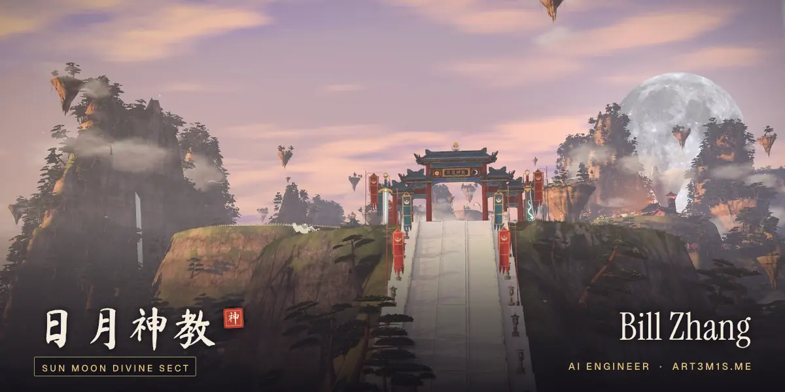
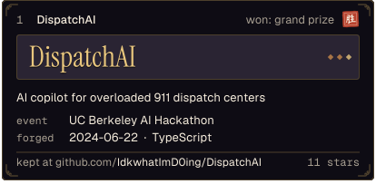
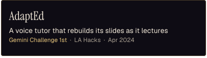
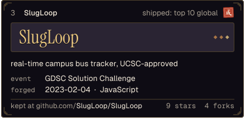

<a id="top"></a>
<!--
  you are reading the back of the scroll. scholars do this. so do spies.
  either way, here is your prize:

  00000000: 796f 7520 7265 6164 2074 6865 2062 6163
  00000010: 6b20 6f66 2074 6865 2073 6372 6f6c 6c2e
  00000020: 206d 656e 7469 6f6e 204d 4f4f 4e20 4741
  00000030: 5445 2077 6865 6e20 796f 7520 656d 6169
  00000040: 6c20 6d65 2061 6e64 2049 276c 6c20 6b6e
  00000050: 6f77 2079 6f75 2072 6561 6420 7468 6520
  00000060: 736f 7572 6365 2e

  (xxd -r if you must. then read .plan.)
-->

<p><a href="https://art3m1s.me"><picture><source media="(max-width: 600px) and (prefers-reduced-motion: reduce)" srcset="assets/gate/hero-phone-still.webp"><source media="(max-width: 600px)" srcset="assets/gate/hero-phone.webp"><source media="(prefers-color-scheme: light)" srcset="assets/gate/hero-light.webp"><source media="(prefers-reduced-motion: reduce)" srcset="assets/gate/hero-still.webp"></picture></a></p>

<p><a href="https://art3m1s.me"><picture><source media="(prefers-color-scheme: light)" srcset="assets/keys/site-light.svg"></picture></a><a href="mailto:billzhangsc@gmail.com"><picture><source media="(prefers-color-scheme: light)" srcset="assets/keys/mail-light.svg"></picture></a><a href="https://linkedin.com/in/bill-zhang1"><picture><source media="(prefers-color-scheme: light)" srcset="assets/keys/linkedin-light.svg"></picture></a><a href="https://art3m1s.me/resume.pdf"><picture><source media="(prefers-color-scheme: light)" srcset="assets/keys/resume-light.svg"></picture></a></p>

<p>I build voice-first LLM agents at Pinterest, and I've won 36 of the 59 hackathons I've entered. Before that I shipped a multi-agent claims system at Scale AI that handled up to 20K claims a week. I care about latency, keeping a human in the loop, and what happens when the model is wrong.</p>

<a id="shipped"></a>
<p><picture><source media="(max-width: 600px)" srcset="assets/banners/shipped-phone.svg"><source media="(prefers-color-scheme: light)" srcset="assets/banners/shipped-light.svg"></picture></p>

<!-- HACKLOG:START -->
<p><a href="https://github.com/aurelisajuan/TalkTuahBank"><picture><source media="(max-width: 600px)" srcset="assets/forge/talktuahbank-phone.svg"><source media="(prefers-color-scheme: light)" srcset="assets/forge/talktuahbank-light.svg"></picture></a><a href="https://github.com/IdkwhatImD0ing/DispatchAI"><picture><source media="(max-width: 600px)" srcset="assets/forge/dispatchai-phone.svg"><source media="(prefers-color-scheme: light)" srcset="assets/forge/dispatchai-light.svg"></picture></a><br>
<a href="https://github.com/IdkwhatImD0ing/AdaptEd"><picture><source media="(max-width: 600px)" srcset="assets/forge/adapted-phone.svg"><source media="(prefers-color-scheme: light)" srcset="assets/forge/adapted-light.svg"></picture></a><a href="https://github.com/SlugLoop/SlugLoop"><picture><source media="(max-width: 600px)" srcset="assets/forge/slugloop-phone.svg"><source media="(prefers-color-scheme: light)" srcset="assets/forge/slugloop-light.svg"></picture></a></p>
<!-- HACKLOG:END -->

<p><picture><source media="(max-width: 600px)" srcset="assets/arena/record-phone.svg"><source media="(prefers-color-scheme: light)" srcset="assets/arena/record-light.svg"></picture></p>

<p>Most of the wins came in college. I still enter a few a year, and I judged LA Hacks 2026. I share what I learned in <a href="https://thehackathonplaybook.dev">The Hackathon Playbook</a> and on <a href="https://www.youtube.com/@hackable-projects">YouTube</a>, and the builds are on <a href="https://devpost.com/IdkwhatImD0ing">Devpost</a>.</p>

<a id="work"></a>
<p><picture><source media="(max-width: 600px)" srcset="assets/banners/work-phone.svg"><source media="(prefers-color-scheme: light)" srcset="assets/banners/work-light.svg"></picture></p>

<p><b>Pinterest</b>, Software Engineer II, 2026–now. LLM agent systems: tool use, RAG, guardrails.<br>
<b>Scale AI</b>, Applied AI Engineer, 2025–2026. Multi-agent claims system, up to 20K claims a week.<br>
<b>RingCentral</b>, AI Engineer, 2023–2025. LLM evals for 10,000+ weekly support chats; 8 hours cut to 1.<br>
<b>Dispatch AI</b>, Co-founder, 2024. Voice agent for 911 dispatch; $50K from Berkeley SkyDeck and AIC.<br>
<b>SlugLoop</b>, Founder, 2023–2024. UCSC's real-time bus tracker, 20,000+ users.<br>
<b>X-Camp</b>, Instructor, 2022–2023. Taught Python and coached USACO students.</p>

<p><b>USC</b>, M.S. Computer Science, AI specialization, 2023–2025.<br>
<b>UC Santa Cruz</b>, B.S. Computer Science in 2.5 years, 2020–2023.</p>

<p>I work in TypeScript and Python, with React, Next.js, FastAPI and Postgres, and Retell, ElevenLabs, Hume and Twilio for voice.</p>

<a id="now"></a>
<p><picture><source media="(max-width: 600px)" srcset="assets/banners/now-phone.svg"><source media="(prefers-color-scheme: light)" srcset="assets/banners/now-light.svg"></picture></p>

<!-- NOW:START -->
<p><b><a href="https://github.com/IdkwhatImD0ing/PortfolioV5">PortfolioV5</a></b> · Oct 24 · Updating sect background look with new visual elements.<br>
<b><a href="https://github.com/IdkwhatImD0ing/hackathonstarterkit">hackathonstarterkit</a></b> · Oct 14 · Replacing homepage MCP prompt with an agent install dropdown.<br>
<b><a href="https://github.com/IdkwhatImD0ing/claude-music-videos">claude-music-videos</a></b> · Oct 4 · Adding PARANOIA music video to the repository.</p>
<!-- NOW:END -->

<p><sub>Posted twice a week by the steward, an LLM that reads my public commits. <a href=".github/workflows/profile-summary.yaml">How it works</a></sub></p>

<p>&nbsp;</p>

<a id="play"></a><a id="fsck"></a>
<details>
<summary>Play: 破阵, break the sect's formation. A minesweeper you play by opening issues.</summary>

<p>81 nodes, 10 of them traps. Click a node and submit the issue as it is; the formation answers in about a minute. A number counts the traps touching that node, and the first step is always safe.</p>

<!-- FSCK:START -->
<p>
<picture><source media="(max-width: 600px)" srcset="assets/formation/panel-0-phone.svg"><source media="(prefers-color-scheme: light)" srcset="assets/formation/panel-0-light.svg"></picture><picture><source media="(max-width: 600px)" srcset="assets/formation/tiles/dark/cols.svg"><source media="(prefers-color-scheme: light)" srcset="assets/formation/tiles/light/cols.svg"></picture><br>
<picture><source media="(max-width: 600px)" srcset="assets/formation/tiles/dark/r1.svg"><source media="(prefers-color-scheme: light)" srcset="assets/formation/tiles/light/r1.svg"></picture><a href="https://github.com/IdkwhatImD0ing/IdkwhatImD0ing/issues/new?title=sect%7Czhen%7CA1&amp;body=Submit+this+petition+as-is+to+read+node+A1+of+the+grand+formation.%0AThe+formation+answers+with+an+eyes+reaction+and+redraws+the+board+in+about+a+minute."><picture><source media="(max-width: 600px)" srcset="assets/formation/tiles/dark/hidden.svg"><source media="(prefers-color-scheme: light)" srcset="assets/formation/tiles/light/hidden.svg"></picture></a><a href="https://github.com/IdkwhatImD0ing/IdkwhatImD0ing/issues/new?title=sect%7Czhen%7CB1&amp;body=Submit+this+petition+as-is+to+read+node+B1+of+the+grand+formation.%0AThe+formation+answers+with+an+eyes+reaction+and+redraws+the+board+in+about+a+minute."><picture><source media="(max-width: 600px)" srcset="assets/formation/tiles/dark/hidden.svg"><source media="(prefers-color-scheme: light)" srcset="assets/formation/tiles/light/hidden.svg"></picture></a><a href="https://github.com/IdkwhatImD0ing/IdkwhatImD0ing/issues/new?title=sect%7Czhen%7CC1&amp;body=Submit+this+petition+as-is+to+read+node+C1+of+the+grand+formation.%0AThe+formation+answers+with+an+eyes+reaction+and+redraws+the+board+in+about+a+minute."><picture><source media="(max-width: 600px)" srcset="assets/formation/tiles/dark/hidden.svg"><source media="(prefers-color-scheme: light)" srcset="assets/formation/tiles/light/hidden.svg"></picture></a><a href="https://github.com/IdkwhatImD0ing/IdkwhatImD0ing/issues/new?title=sect%7Czhen%7CD1&amp;body=Submit+this+petition+as-is+to+read+node+D1+of+the+grand+formation.%0AThe+formation+answers+with+an+eyes+reaction+and+redraws+the+board+in+about+a+minute."><picture><source media="(max-width: 600px)" srcset="assets/formation/tiles/dark/hidden.svg"><source media="(prefers-color-scheme: light)" srcset="assets/formation/tiles/light/hidden.svg"></picture></a><a href="https://github.com/IdkwhatImD0ing/IdkwhatImD0ing/issues/new?title=sect%7Czhen%7CE1&amp;body=Submit+this+petition+as-is+to+read+node+E1+of+the+grand+formation.%0AThe+formation+answers+with+an+eyes+reaction+and+redraws+the+board+in+about+a+minute."><picture><source media="(max-width: 600px)" srcset="assets/formation/tiles/dark/hidden.svg"><source media="(prefers-color-scheme: light)" srcset="assets/formation/tiles/light/hidden.svg"></picture></a><a href="https://github.com/IdkwhatImD0ing/IdkwhatImD0ing/issues/new?title=sect%7Czhen%7CF1&amp;body=Submit+this+petition+as-is+to+read+node+F1+of+the+grand+formation.%0AThe+formation+answers+with+an+eyes+reaction+and+redraws+the+board+in+about+a+minute."><picture><source media="(max-width: 600px)" srcset="assets/formation/tiles/dark/hidden.svg"><source media="(prefers-color-scheme: light)" srcset="assets/formation/tiles/light/hidden.svg"></picture></a><a href="https://github.com/IdkwhatImD0ing/IdkwhatImD0ing/issues/new?title=sect%7Czhen%7CG1&amp;body=Submit+this+petition+as-is+to+read+node+G1+of+the+grand+formation.%0AThe+formation+answers+with+an+eyes+reaction+and+redraws+the+board+in+about+a+minute."><picture><source media="(max-width: 600px)" srcset="assets/formation/tiles/dark/hidden.svg"><source media="(prefers-color-scheme: light)" srcset="assets/formation/tiles/light/hidden.svg"></picture></a><a href="https://github.com/IdkwhatImD0ing/IdkwhatImD0ing/issues/new?title=sect%7Czhen%7CH1&amp;body=Submit+this+petition+as-is+to+read+node+H1+of+the+grand+formation.%0AThe+formation+answers+with+an+eyes+reaction+and+redraws+the+board+in+about+a+minute."><picture><source media="(max-width: 600px)" srcset="assets/formation/tiles/dark/hidden.svg"><source media="(prefers-color-scheme: light)" srcset="assets/formation/tiles/light/hidden.svg"></picture></a><a href="https://github.com/IdkwhatImD0ing/IdkwhatImD0ing/issues/new?title=sect%7Czhen%7CI1&amp;body=Submit+this+petition+as-is+to+read+node+I1+of+the+grand+formation.%0AThe+formation+answers+with+an+eyes+reaction+and+redraws+the+board+in+about+a+minute."><picture><source media="(max-width: 600px)" srcset="assets/formation/tiles/dark/hidden.svg"><source media="(prefers-color-scheme: light)" srcset="assets/formation/tiles/light/hidden.svg"></picture></a><picture><source media="(max-width: 600px)" srcset="assets/formation/tiles/dark/edge.svg"><source media="(prefers-color-scheme: light)" srcset="assets/formation/tiles/light/edge.svg"></picture><br>
<picture><source media="(max-width: 600px)" srcset="assets/formation/tiles/dark/r2.svg"><source media="(prefers-color-scheme: light)" srcset="assets/formation/tiles/light/r2.svg"></picture><a href="https://github.com/IdkwhatImD0ing/IdkwhatImD0ing/issues/new?title=sect%7Czhen%7CA2&amp;body=Submit+this+petition+as-is+to+read+node+A2+of+the+grand+formation.%0AThe+formation+answers+with+an+eyes+reaction+and+redraws+the+board+in+about+a+minute."><picture><source media="(max-width: 600px)" srcset="assets/formation/tiles/dark/hidden.svg"><source media="(prefers-color-scheme: light)" srcset="assets/formation/tiles/light/hidden.svg"></picture></a><a href="https://github.com/IdkwhatImD0ing/IdkwhatImD0ing/issues/new?title=sect%7Czhen%7CB2&amp;body=Submit+this+petition+as-is+to+read+node+B2+of+the+grand+formation.%0AThe+formation+answers+with+an+eyes+reaction+and+redraws+the+board+in+about+a+minute."><picture><source media="(max-width: 600px)" srcset="assets/formation/tiles/dark/hidden.svg"><source media="(prefers-color-scheme: light)" srcset="assets/formation/tiles/light/hidden.svg"></picture></a><a href="https://github.com/IdkwhatImD0ing/IdkwhatImD0ing/issues/new?title=sect%7Czhen%7CC2&amp;body=Submit+this+petition+as-is+to+read+node+C2+of+the+grand+formation.%0AThe+formation+answers+with+an+eyes+reaction+and+redraws+the+board+in+about+a+minute."><picture><source media="(max-width: 600px)" srcset="assets/formation/tiles/dark/hidden.svg"><source media="(prefers-color-scheme: light)" srcset="assets/formation/tiles/light/hidden.svg"></picture></a><a href="https://github.com/IdkwhatImD0ing/IdkwhatImD0ing/issues/new?title=sect%7Czhen%7CD2&amp;body=Submit+this+petition+as-is+to+read+node+D2+of+the+grand+formation.%0AThe+formation+answers+with+an+eyes+reaction+and+redraws+the+board+in+about+a+minute."><picture><source media="(max-width: 600px)" srcset="assets/formation/tiles/dark/hidden.svg"><source media="(prefers-color-scheme: light)" srcset="assets/formation/tiles/light/hidden.svg"></picture></a><a href="https://github.com/IdkwhatImD0ing/IdkwhatImD0ing/issues/new?title=sect%7Czhen%7CE2&amp;body=Submit+this+petition+as-is+to+read+node+E2+of+the+grand+formation.%0AThe+formation+answers+with+an+eyes+reaction+and+redraws+the+board+in+about+a+minute."><picture><source media="(max-width: 600px)" srcset="assets/formation/tiles/dark/hidden.svg"><source media="(prefers-color-scheme: light)" srcset="assets/formation/tiles/light/hidden.svg"></picture></a><a href="https://github.com/IdkwhatImD0ing/IdkwhatImD0ing/issues/new?title=sect%7Czhen%7CF2&amp;body=Submit+this+petition+as-is+to+read+node+F2+of+the+grand+formation.%0AThe+formation+answers+with+an+eyes+reaction+and+redraws+the+board+in+about+a+minute."><picture><source media="(max-width: 600px)" srcset="assets/formation/tiles/dark/hidden.svg"><source media="(prefers-color-scheme: light)" srcset="assets/formation/tiles/light/hidden.svg"></picture></a><a href="https://github.com/IdkwhatImD0ing/IdkwhatImD0ing/issues/new?title=sect%7Czhen%7CG2&amp;body=Submit+this+petition+as-is+to+read+node+G2+of+the+grand+formation.%0AThe+formation+answers+with+an+eyes+reaction+and+redraws+the+board+in+about+a+minute."><picture><source media="(max-width: 600px)" srcset="assets/formation/tiles/dark/hidden.svg"><source media="(prefers-color-scheme: light)" srcset="assets/formation/tiles/light/hidden.svg"></picture></a><a href="https://github.com/IdkwhatImD0ing/IdkwhatImD0ing/issues/new?title=sect%7Czhen%7CH2&amp;body=Submit+this+petition+as-is+to+read+node+H2+of+the+grand+formation.%0AThe+formation+answers+with+an+eyes+reaction+and+redraws+the+board+in+about+a+minute."><picture><source media="(max-width: 600px)" srcset="assets/formation/tiles/dark/hidden.svg"><source media="(prefers-color-scheme: light)" srcset="assets/formation/tiles/light/hidden.svg"></picture></a><a href="https://github.com/IdkwhatImD0ing/IdkwhatImD0ing/issues/new?title=sect%7Czhen%7CI2&amp;body=Submit+this+petition+as-is+to+read+node+I2+of+the+grand+formation.%0AThe+formation+answers+with+an+eyes+reaction+and+redraws+the+board+in+about+a+minute."><picture><source media="(max-width: 600px)" srcset="assets/formation/tiles/dark/hidden.svg"><source media="(prefers-color-scheme: light)" srcset="assets/formation/tiles/light/hidden.svg"></picture></a><picture><source media="(max-width: 600px)" srcset="assets/formation/tiles/dark/edge.svg"><source media="(prefers-color-scheme: light)" srcset="assets/formation/tiles/light/edge.svg"></picture><br>
<picture><source media="(max-width: 600px)" srcset="assets/formation/tiles/dark/r3.svg"><source media="(prefers-color-scheme: light)" srcset="assets/formation/tiles/light/r3.svg"></picture><a href="https://github.com/IdkwhatImD0ing/IdkwhatImD0ing/issues/new?title=sect%7Czhen%7CA3&amp;body=Submit+this+petition+as-is+to+read+node+A3+of+the+grand+formation.%0AThe+formation+answers+with+an+eyes+reaction+and+redraws+the+board+in+about+a+minute."><picture><source media="(max-width: 600px)" srcset="assets/formation/tiles/dark/hidden.svg"><source media="(prefers-color-scheme: light)" srcset="assets/formation/tiles/light/hidden.svg"></picture></a><a href="https://github.com/IdkwhatImD0ing/IdkwhatImD0ing/issues/new?title=sect%7Czhen%7CB3&amp;body=Submit+this+petition+as-is+to+read+node+B3+of+the+grand+formation.%0AThe+formation+answers+with+an+eyes+reaction+and+redraws+the+board+in+about+a+minute."><picture><source media="(max-width: 600px)" srcset="assets/formation/tiles/dark/hidden.svg"><source media="(prefers-color-scheme: light)" srcset="assets/formation/tiles/light/hidden.svg"></picture></a><a href="https://github.com/IdkwhatImD0ing/IdkwhatImD0ing/issues/new?title=sect%7Czhen%7CC3&amp;body=Submit+this+petition+as-is+to+read+node+C3+of+the+grand+formation.%0AThe+formation+answers+with+an+eyes+reaction+and+redraws+the+board+in+about+a+minute."><picture><source media="(max-width: 600px)" srcset="assets/formation/tiles/dark/hidden.svg"><source media="(prefers-color-scheme: light)" srcset="assets/formation/tiles/light/hidden.svg"></picture></a><a href="https://github.com/IdkwhatImD0ing/IdkwhatImD0ing/issues/new?title=sect%7Czhen%7CD3&amp;body=Submit+this+petition+as-is+to+read+node+D3+of+the+grand+formation.%0AThe+formation+answers+with+an+eyes+reaction+and+redraws+the+board+in+about+a+minute."><picture><source media="(max-width: 600px)" srcset="assets/formation/tiles/dark/hidden.svg"><source media="(prefers-color-scheme: light)" srcset="assets/formation/tiles/light/hidden.svg"></picture></a><a href="https://github.com/IdkwhatImD0ing/IdkwhatImD0ing/issues/new?title=sect%7Czhen%7CE3&amp;body=Submit+this+petition+as-is+to+read+node+E3+of+the+grand+formation.%0AThe+formation+answers+with+an+eyes+reaction+and+redraws+the+board+in+about+a+minute."><picture><source media="(max-width: 600px)" srcset="assets/formation/tiles/dark/hidden.svg"><source media="(prefers-color-scheme: light)" srcset="assets/formation/tiles/light/hidden.svg"></picture></a><a href="https://github.com/IdkwhatImD0ing/IdkwhatImD0ing/issues/new?title=sect%7Czhen%7CF3&amp;body=Submit+this+petition+as-is+to+read+node+F3+of+the+grand+formation.%0AThe+formation+answers+with+an+eyes+reaction+and+redraws+the+board+in+about+a+minute."><picture><source media="(max-width: 600px)" srcset="assets/formation/tiles/dark/hidden.svg"><source media="(prefers-color-scheme: light)" srcset="assets/formation/tiles/light/hidden.svg"></picture></a><a href="https://github.com/IdkwhatImD0ing/IdkwhatImD0ing/issues/new?title=sect%7Czhen%7CG3&amp;body=Submit+this+petition+as-is+to+read+node+G3+of+the+grand+formation.%0AThe+formation+answers+with+an+eyes+reaction+and+redraws+the+board+in+about+a+minute."><picture><source media="(max-width: 600px)" srcset="assets/formation/tiles/dark/hidden.svg"><source media="(prefers-color-scheme: light)" srcset="assets/formation/tiles/light/hidden.svg"></picture></a><a href="https://github.com/IdkwhatImD0ing/IdkwhatImD0ing/issues/new?title=sect%7Czhen%7CH3&amp;body=Submit+this+petition+as-is+to+read+node+H3+of+the+grand+formation.%0AThe+formation+answers+with+an+eyes+reaction+and+redraws+the+board+in+about+a+minute."><picture><source media="(max-width: 600px)" srcset="assets/formation/tiles/dark/hidden.svg"><source media="(prefers-color-scheme: light)" srcset="assets/formation/tiles/light/hidden.svg"></picture></a><a href="https://github.com/IdkwhatImD0ing/IdkwhatImD0ing/issues/new?title=sect%7Czhen%7CI3&amp;body=Submit+this+petition+as-is+to+read+node+I3+of+the+grand+formation.%0AThe+formation+answers+with+an+eyes+reaction+and+redraws+the+board+in+about+a+minute."><picture><source media="(max-width: 600px)" srcset="assets/formation/tiles/dark/hidden.svg"><source media="(prefers-color-scheme: light)" srcset="assets/formation/tiles/light/hidden.svg"></picture></a><picture><source media="(max-width: 600px)" srcset="assets/formation/tiles/dark/edge.svg"><source media="(prefers-color-scheme: light)" srcset="assets/formation/tiles/light/edge.svg"></picture><br>
<picture><source media="(max-width: 600px)" srcset="assets/formation/tiles/dark/r4.svg"><source media="(prefers-color-scheme: light)" srcset="assets/formation/tiles/light/r4.svg"></picture><a href="https://github.com/IdkwhatImD0ing/IdkwhatImD0ing/issues/new?title=sect%7Czhen%7CA4&amp;body=Submit+this+petition+as-is+to+read+node+A4+of+the+grand+formation.%0AThe+formation+answers+with+an+eyes+reaction+and+redraws+the+board+in+about+a+minute."><picture><source media="(max-width: 600px)" srcset="assets/formation/tiles/dark/hidden.svg"><source media="(prefers-color-scheme: light)" srcset="assets/formation/tiles/light/hidden.svg"></picture></a><a href="https://github.com/IdkwhatImD0ing/IdkwhatImD0ing/issues/new?title=sect%7Czhen%7CB4&amp;body=Submit+this+petition+as-is+to+read+node+B4+of+the+grand+formation.%0AThe+formation+answers+with+an+eyes+reaction+and+redraws+the+board+in+about+a+minute."><picture><source media="(max-width: 600px)" srcset="assets/formation/tiles/dark/hidden.svg"><source media="(prefers-color-scheme: light)" srcset="assets/formation/tiles/light/hidden.svg"></picture></a><a href="https://github.com/IdkwhatImD0ing/IdkwhatImD0ing/issues/new?title=sect%7Czhen%7CC4&amp;body=Submit+this+petition+as-is+to+read+node+C4+of+the+grand+formation.%0AThe+formation+answers+with+an+eyes+reaction+and+redraws+the+board+in+about+a+minute."><picture><source media="(max-width: 600px)" srcset="assets/formation/tiles/dark/hidden.svg"><source media="(prefers-color-scheme: light)" srcset="assets/formation/tiles/light/hidden.svg"></picture></a><a href="https://github.com/IdkwhatImD0ing/IdkwhatImD0ing/issues/new?title=sect%7Czhen%7CD4&amp;body=Submit+this+petition+as-is+to+read+node+D4+of+the+grand+formation.%0AThe+formation+answers+with+an+eyes+reaction+and+redraws+the+board+in+about+a+minute."><picture><source media="(max-width: 600px)" srcset="assets/formation/tiles/dark/hidden.svg"><source media="(prefers-color-scheme: light)" srcset="assets/formation/tiles/light/hidden.svg"></picture></a><a href="https://github.com/IdkwhatImD0ing/IdkwhatImD0ing/issues/new?title=sect%7Czhen%7CE4&amp;body=Submit+this+petition+as-is+to+read+node+E4+of+the+grand+formation.%0AThe+formation+answers+with+an+eyes+reaction+and+redraws+the+board+in+about+a+minute."><picture><source media="(max-width: 600px)" srcset="assets/formation/tiles/dark/hidden.svg"><source media="(prefers-color-scheme: light)" srcset="assets/formation/tiles/light/hidden.svg"></picture></a><a href="https://github.com/IdkwhatImD0ing/IdkwhatImD0ing/issues/new?title=sect%7Czhen%7CF4&amp;body=Submit+this+petition+as-is+to+read+node+F4+of+the+grand+formation.%0AThe+formation+answers+with+an+eyes+reaction+and+redraws+the+board+in+about+a+minute."><picture><source media="(max-width: 600px)" srcset="assets/formation/tiles/dark/hidden.svg"><source media="(prefers-color-scheme: light)" srcset="assets/formation/tiles/light/hidden.svg"></picture></a><a href="https://github.com/IdkwhatImD0ing/IdkwhatImD0ing/issues/new?title=sect%7Czhen%7CG4&amp;body=Submit+this+petition+as-is+to+read+node+G4+of+the+grand+formation.%0AThe+formation+answers+with+an+eyes+reaction+and+redraws+the+board+in+about+a+minute."><picture><source media="(max-width: 600px)" srcset="assets/formation/tiles/dark/hidden.svg"><source media="(prefers-color-scheme: light)" srcset="assets/formation/tiles/light/hidden.svg"></picture></a><a href="https://github.com/IdkwhatImD0ing/IdkwhatImD0ing/issues/new?title=sect%7Czhen%7CH4&amp;body=Submit+this+petition+as-is+to+read+node+H4+of+the+grand+formation.%0AThe+formation+answers+with+an+eyes+reaction+and+redraws+the+board+in+about+a+minute."><picture><source media="(max-width: 600px)" srcset="assets/formation/tiles/dark/hidden.svg"><source media="(prefers-color-scheme: light)" srcset="assets/formation/tiles/light/hidden.svg"></picture></a><a href="https://github.com/IdkwhatImD0ing/IdkwhatImD0ing/issues/new?title=sect%7Czhen%7CI4&amp;body=Submit+this+petition+as-is+to+read+node+I4+of+the+grand+formation.%0AThe+formation+answers+with+an+eyes+reaction+and+redraws+the+board+in+about+a+minute."><picture><source media="(max-width: 600px)" srcset="assets/formation/tiles/dark/hidden.svg"><source media="(prefers-color-scheme: light)" srcset="assets/formation/tiles/light/hidden.svg"></picture></a><picture><source media="(max-width: 600px)" srcset="assets/formation/tiles/dark/edge.svg"><source media="(prefers-color-scheme: light)" srcset="assets/formation/tiles/light/edge.svg"></picture><br>
<picture><source media="(max-width: 600px)" srcset="assets/formation/tiles/dark/r5.svg"><source media="(prefers-color-scheme: light)" srcset="assets/formation/tiles/light/r5.svg"></picture><a href="https://github.com/IdkwhatImD0ing/IdkwhatImD0ing/issues/new?title=sect%7Czhen%7CA5&amp;body=Submit+this+petition+as-is+to+read+node+A5+of+the+grand+formation.%0AThe+formation+answers+with+an+eyes+reaction+and+redraws+the+board+in+about+a+minute."><picture><source media="(max-width: 600px)" srcset="assets/formation/tiles/dark/hidden.svg"><source media="(prefers-color-scheme: light)" srcset="assets/formation/tiles/light/hidden.svg"></picture></a><a href="https://github.com/IdkwhatImD0ing/IdkwhatImD0ing/issues/new?title=sect%7Czhen%7CB5&amp;body=Submit+this+petition+as-is+to+read+node+B5+of+the+grand+formation.%0AThe+formation+answers+with+an+eyes+reaction+and+redraws+the+board+in+about+a+minute."><picture><source media="(max-width: 600px)" srcset="assets/formation/tiles/dark/hidden.svg"><source media="(prefers-color-scheme: light)" srcset="assets/formation/tiles/light/hidden.svg"></picture></a><a href="https://github.com/IdkwhatImD0ing/IdkwhatImD0ing/issues/new?title=sect%7Czhen%7CC5&amp;body=Submit+this+petition+as-is+to+read+node+C5+of+the+grand+formation.%0AThe+formation+answers+with+an+eyes+reaction+and+redraws+the+board+in+about+a+minute."><picture><source media="(max-width: 600px)" srcset="assets/formation/tiles/dark/hidden.svg"><source media="(prefers-color-scheme: light)" srcset="assets/formation/tiles/light/hidden.svg"></picture></a><a href="https://github.com/IdkwhatImD0ing/IdkwhatImD0ing/issues/new?title=sect%7Czhen%7CD5&amp;body=Submit+this+petition+as-is+to+read+node+D5+of+the+grand+formation.%0AThe+formation+answers+with+an+eyes+reaction+and+redraws+the+board+in+about+a+minute."><picture><source media="(max-width: 600px)" srcset="assets/formation/tiles/dark/hidden.svg"><source media="(prefers-color-scheme: light)" srcset="assets/formation/tiles/light/hidden.svg"></picture></a><a href="https://github.com/IdkwhatImD0ing/IdkwhatImD0ing/issues/new?title=sect%7Czhen%7CE5&amp;body=Submit+this+petition+as-is+to+read+node+E5+of+the+grand+formation.%0AThe+formation+answers+with+an+eyes+reaction+and+redraws+the+board+in+about+a+minute."><picture><source media="(max-width: 600px)" srcset="assets/formation/tiles/dark/hidden.svg"><source media="(prefers-color-scheme: light)" srcset="assets/formation/tiles/light/hidden.svg"></picture></a><a href="https://github.com/IdkwhatImD0ing/IdkwhatImD0ing/issues/new?title=sect%7Czhen%7CF5&amp;body=Submit+this+petition+as-is+to+read+node+F5+of+the+grand+formation.%0AThe+formation+answers+with+an+eyes+reaction+and+redraws+the+board+in+about+a+minute."><picture><source media="(max-width: 600px)" srcset="assets/formation/tiles/dark/hidden.svg"><source media="(prefers-color-scheme: light)" srcset="assets/formation/tiles/light/hidden.svg"></picture></a><a href="https://github.com/IdkwhatImD0ing/IdkwhatImD0ing/issues/new?title=sect%7Czhen%7CG5&amp;body=Submit+this+petition+as-is+to+read+node+G5+of+the+grand+formation.%0AThe+formation+answers+with+an+eyes+reaction+and+redraws+the+board+in+about+a+minute."><picture><source media="(max-width: 600px)" srcset="assets/formation/tiles/dark/hidden.svg"><source media="(prefers-color-scheme: light)" srcset="assets/formation/tiles/light/hidden.svg"></picture></a><a href="https://github.com/IdkwhatImD0ing/IdkwhatImD0ing/issues/new?title=sect%7Czhen%7CH5&amp;body=Submit+this+petition+as-is+to+read+node+H5+of+the+grand+formation.%0AThe+formation+answers+with+an+eyes+reaction+and+redraws+the+board+in+about+a+minute."><picture><source media="(max-width: 600px)" srcset="assets/formation/tiles/dark/hidden.svg"><source media="(prefers-color-scheme: light)" srcset="assets/formation/tiles/light/hidden.svg"></picture></a><a href="https://github.com/IdkwhatImD0ing/IdkwhatImD0ing/issues/new?title=sect%7Czhen%7CI5&amp;body=Submit+this+petition+as-is+to+read+node+I5+of+the+grand+formation.%0AThe+formation+answers+with+an+eyes+reaction+and+redraws+the+board+in+about+a+minute."><picture><source media="(max-width: 600px)" srcset="assets/formation/tiles/dark/hidden.svg"><source media="(prefers-color-scheme: light)" srcset="assets/formation/tiles/light/hidden.svg"></picture></a><picture><source media="(max-width: 600px)" srcset="assets/formation/tiles/dark/edge.svg"><source media="(prefers-color-scheme: light)" srcset="assets/formation/tiles/light/edge.svg"></picture><br>
<picture><source media="(max-width: 600px)" srcset="assets/formation/tiles/dark/r6.svg"><source media="(prefers-color-scheme: light)" srcset="assets/formation/tiles/light/r6.svg"></picture><a href="https://github.com/IdkwhatImD0ing/IdkwhatImD0ing/issues/new?title=sect%7Czhen%7CA6&amp;body=Submit+this+petition+as-is+to+read+node+A6+of+the+grand+formation.%0AThe+formation+answers+with+an+eyes+reaction+and+redraws+the+board+in+about+a+minute."><picture><source media="(max-width: 600px)" srcset="assets/formation/tiles/dark/hidden.svg"><source media="(prefers-color-scheme: light)" srcset="assets/formation/tiles/light/hidden.svg"></picture></a><a href="https://github.com/IdkwhatImD0ing/IdkwhatImD0ing/issues/new?title=sect%7Czhen%7CB6&amp;body=Submit+this+petition+as-is+to+read+node+B6+of+the+grand+formation.%0AThe+formation+answers+with+an+eyes+reaction+and+redraws+the+board+in+about+a+minute."><picture><source media="(max-width: 600px)" srcset="assets/formation/tiles/dark/hidden.svg"><source media="(prefers-color-scheme: light)" srcset="assets/formation/tiles/light/hidden.svg"></picture></a><a href="https://github.com/IdkwhatImD0ing/IdkwhatImD0ing/issues/new?title=sect%7Czhen%7CC6&amp;body=Submit+this+petition+as-is+to+read+node+C6+of+the+grand+formation.%0AThe+formation+answers+with+an+eyes+reaction+and+redraws+the+board+in+about+a+minute."><picture><source media="(max-width: 600px)" srcset="assets/formation/tiles/dark/hidden.svg"><source media="(prefers-color-scheme: light)" srcset="assets/formation/tiles/light/hidden.svg"></picture></a><a href="https://github.com/IdkwhatImD0ing/IdkwhatImD0ing/issues/new?title=sect%7Czhen%7CD6&amp;body=Submit+this+petition+as-is+to+read+node+D6+of+the+grand+formation.%0AThe+formation+answers+with+an+eyes+reaction+and+redraws+the+board+in+about+a+minute."><picture><source media="(max-width: 600px)" srcset="assets/formation/tiles/dark/hidden.svg"><source media="(prefers-color-scheme: light)" srcset="assets/formation/tiles/light/hidden.svg"></picture></a><a href="https://github.com/IdkwhatImD0ing/IdkwhatImD0ing/issues/new?title=sect%7Czhen%7CE6&amp;body=Submit+this+petition+as-is+to+read+node+E6+of+the+grand+formation.%0AThe+formation+answers+with+an+eyes+reaction+and+redraws+the+board+in+about+a+minute."><picture><source media="(max-width: 600px)" srcset="assets/formation/tiles/dark/hidden.svg"><source media="(prefers-color-scheme: light)" srcset="assets/formation/tiles/light/hidden.svg"></picture></a><a href="https://github.com/IdkwhatImD0ing/IdkwhatImD0ing/issues/new?title=sect%7Czhen%7CF6&amp;body=Submit+this+petition+as-is+to+read+node+F6+of+the+grand+formation.%0AThe+formation+answers+with+an+eyes+reaction+and+redraws+the+board+in+about+a+minute."><picture><source media="(max-width: 600px)" srcset="assets/formation/tiles/dark/hidden.svg"><source media="(prefers-color-scheme: light)" srcset="assets/formation/tiles/light/hidden.svg"></picture></a><a href="https://github.com/IdkwhatImD0ing/IdkwhatImD0ing/issues/new?title=sect%7Czhen%7CG6&amp;body=Submit+this+petition+as-is+to+read+node+G6+of+the+grand+formation.%0AThe+formation+answers+with+an+eyes+reaction+and+redraws+the+board+in+about+a+minute."><picture><source media="(max-width: 600px)" srcset="assets/formation/tiles/dark/hidden.svg"><source media="(prefers-color-scheme: light)" srcset="assets/formation/tiles/light/hidden.svg"></picture></a><a href="https://github.com/IdkwhatImD0ing/IdkwhatImD0ing/issues/new?title=sect%7Czhen%7CH6&amp;body=Submit+this+petition+as-is+to+read+node+H6+of+the+grand+formation.%0AThe+formation+answers+with+an+eyes+reaction+and+redraws+the+board+in+about+a+minute."><picture><source media="(max-width: 600px)" srcset="assets/formation/tiles/dark/hidden.svg"><source media="(prefers-color-scheme: light)" srcset="assets/formation/tiles/light/hidden.svg"></picture></a><a href="https://github.com/IdkwhatImD0ing/IdkwhatImD0ing/issues/new?title=sect%7Czhen%7CI6&amp;body=Submit+this+petition+as-is+to+read+node+I6+of+the+grand+formation.%0AThe+formation+answers+with+an+eyes+reaction+and+redraws+the+board+in+about+a+minute."><picture><source media="(max-width: 600px)" srcset="assets/formation/tiles/dark/hidden.svg"><source media="(prefers-color-scheme: light)" srcset="assets/formation/tiles/light/hidden.svg"></picture></a><picture><source media="(max-width: 600px)" srcset="assets/formation/tiles/dark/edge.svg"><source media="(prefers-color-scheme: light)" srcset="assets/formation/tiles/light/edge.svg"></picture><br>
<picture><source media="(max-width: 600px)" srcset="assets/formation/tiles/dark/r7.svg"><source media="(prefers-color-scheme: light)" srcset="assets/formation/tiles/light/r7.svg"></picture><a href="https://github.com/IdkwhatImD0ing/IdkwhatImD0ing/issues/new?title=sect%7Czhen%7CA7&amp;body=Submit+this+petition+as-is+to+read+node+A7+of+the+grand+formation.%0AThe+formation+answers+with+an+eyes+reaction+and+redraws+the+board+in+about+a+minute."><picture><source media="(max-width: 600px)" srcset="assets/formation/tiles/dark/hidden.svg"><source media="(prefers-color-scheme: light)" srcset="assets/formation/tiles/light/hidden.svg"></picture></a><a href="https://github.com/IdkwhatImD0ing/IdkwhatImD0ing/issues/new?title=sect%7Czhen%7CB7&amp;body=Submit+this+petition+as-is+to+read+node+B7+of+the+grand+formation.%0AThe+formation+answers+with+an+eyes+reaction+and+redraws+the+board+in+about+a+minute."><picture><source media="(max-width: 600px)" srcset="assets/formation/tiles/dark/hidden.svg"><source media="(prefers-color-scheme: light)" srcset="assets/formation/tiles/light/hidden.svg"></picture></a><a href="https://github.com/IdkwhatImD0ing/IdkwhatImD0ing/issues/new?title=sect%7Czhen%7CC7&amp;body=Submit+this+petition+as-is+to+read+node+C7+of+the+grand+formation.%0AThe+formation+answers+with+an+eyes+reaction+and+redraws+the+board+in+about+a+minute."><picture><source media="(max-width: 600px)" srcset="assets/formation/tiles/dark/hidden.svg"><source media="(prefers-color-scheme: light)" srcset="assets/formation/tiles/light/hidden.svg"></picture></a><a href="https://github.com/IdkwhatImD0ing/IdkwhatImD0ing/issues/new?title=sect%7Czhen%7CD7&amp;body=Submit+this+petition+as-is+to+read+node+D7+of+the+grand+formation.%0AThe+formation+answers+with+an+eyes+reaction+and+redraws+the+board+in+about+a+minute."><picture><source media="(max-width: 600px)" srcset="assets/formation/tiles/dark/hidden.svg"><source media="(prefers-color-scheme: light)" srcset="assets/formation/tiles/light/hidden.svg"></picture></a><a href="https://github.com/IdkwhatImD0ing/IdkwhatImD0ing/issues/new?title=sect%7Czhen%7CE7&amp;body=Submit+this+petition+as-is+to+read+node+E7+of+the+grand+formation.%0AThe+formation+answers+with+an+eyes+reaction+and+redraws+the+board+in+about+a+minute."><picture><source media="(max-width: 600px)" srcset="assets/formation/tiles/dark/hidden.svg"><source media="(prefers-color-scheme: light)" srcset="assets/formation/tiles/light/hidden.svg"></picture></a><a href="https://github.com/IdkwhatImD0ing/IdkwhatImD0ing/issues/new?title=sect%7Czhen%7CF7&amp;body=Submit+this+petition+as-is+to+read+node+F7+of+the+grand+formation.%0AThe+formation+answers+with+an+eyes+reaction+and+redraws+the+board+in+about+a+minute."><picture><source media="(max-width: 600px)" srcset="assets/formation/tiles/dark/hidden.svg"><source media="(prefers-color-scheme: light)" srcset="assets/formation/tiles/light/hidden.svg"></picture></a><a href="https://github.com/IdkwhatImD0ing/IdkwhatImD0ing/issues/new?title=sect%7Czhen%7CG7&amp;body=Submit+this+petition+as-is+to+read+node+G7+of+the+grand+formation.%0AThe+formation+answers+with+an+eyes+reaction+and+redraws+the+board+in+about+a+minute."><picture><source media="(max-width: 600px)" srcset="assets/formation/tiles/dark/hidden.svg"><source media="(prefers-color-scheme: light)" srcset="assets/formation/tiles/light/hidden.svg"></picture></a><a href="https://github.com/IdkwhatImD0ing/IdkwhatImD0ing/issues/new?title=sect%7Czhen%7CH7&amp;body=Submit+this+petition+as-is+to+read+node+H7+of+the+grand+formation.%0AThe+formation+answers+with+an+eyes+reaction+and+redraws+the+board+in+about+a+minute."><picture><source media="(max-width: 600px)" srcset="assets/formation/tiles/dark/hidden.svg"><source media="(prefers-color-scheme: light)" srcset="assets/formation/tiles/light/hidden.svg"></picture></a><a href="https://github.com/IdkwhatImD0ing/IdkwhatImD0ing/issues/new?title=sect%7Czhen%7CI7&amp;body=Submit+this+petition+as-is+to+read+node+I7+of+the+grand+formation.%0AThe+formation+answers+with+an+eyes+reaction+and+redraws+the+board+in+about+a+minute."><picture><source media="(max-width: 600px)" srcset="assets/formation/tiles/dark/hidden.svg"><source media="(prefers-color-scheme: light)" srcset="assets/formation/tiles/light/hidden.svg"></picture></a><picture><source media="(max-width: 600px)" srcset="assets/formation/tiles/dark/edge.svg"><source media="(prefers-color-scheme: light)" srcset="assets/formation/tiles/light/edge.svg"></picture><br>
<picture><source media="(max-width: 600px)" srcset="assets/formation/tiles/dark/r8.svg"><source media="(prefers-color-scheme: light)" srcset="assets/formation/tiles/light/r8.svg"></picture><a href="https://github.com/IdkwhatImD0ing/IdkwhatImD0ing/issues/new?title=sect%7Czhen%7CA8&amp;body=Submit+this+petition+as-is+to+read+node+A8+of+the+grand+formation.%0AThe+formation+answers+with+an+eyes+reaction+and+redraws+the+board+in+about+a+minute."><picture><source media="(max-width: 600px)" srcset="assets/formation/tiles/dark/hidden.svg"><source media="(prefers-color-scheme: light)" srcset="assets/formation/tiles/light/hidden.svg"></picture></a><a href="https://github.com/IdkwhatImD0ing/IdkwhatImD0ing/issues/new?title=sect%7Czhen%7CB8&amp;body=Submit+this+petition+as-is+to+read+node+B8+of+the+grand+formation.%0AThe+formation+answers+with+an+eyes+reaction+and+redraws+the+board+in+about+a+minute."><picture><source media="(max-width: 600px)" srcset="assets/formation/tiles/dark/hidden.svg"><source media="(prefers-color-scheme: light)" srcset="assets/formation/tiles/light/hidden.svg"></picture></a><a href="https://github.com/IdkwhatImD0ing/IdkwhatImD0ing/issues/new?title=sect%7Czhen%7CC8&amp;body=Submit+this+petition+as-is+to+read+node+C8+of+the+grand+formation.%0AThe+formation+answers+with+an+eyes+reaction+and+redraws+the+board+in+about+a+minute."><picture><source media="(max-width: 600px)" srcset="assets/formation/tiles/dark/hidden.svg"><source media="(prefers-color-scheme: light)" srcset="assets/formation/tiles/light/hidden.svg"></picture></a><a href="https://github.com/IdkwhatImD0ing/IdkwhatImD0ing/issues/new?title=sect%7Czhen%7CD8&amp;body=Submit+this+petition+as-is+to+read+node+D8+of+the+grand+formation.%0AThe+formation+answers+with+an+eyes+reaction+and+redraws+the+board+in+about+a+minute."><picture><source media="(max-width: 600px)" srcset="assets/formation/tiles/dark/hidden.svg"><source media="(prefers-color-scheme: light)" srcset="assets/formation/tiles/light/hidden.svg"></picture></a><a href="https://github.com/IdkwhatImD0ing/IdkwhatImD0ing/issues/new?title=sect%7Czhen%7CE8&amp;body=Submit+this+petition+as-is+to+read+node+E8+of+the+grand+formation.%0AThe+formation+answers+with+an+eyes+reaction+and+redraws+the+board+in+about+a+minute."><picture><source media="(max-width: 600px)" srcset="assets/formation/tiles/dark/hidden.svg"><source media="(prefers-color-scheme: light)" srcset="assets/formation/tiles/light/hidden.svg"></picture></a><a href="https://github.com/IdkwhatImD0ing/IdkwhatImD0ing/issues/new?title=sect%7Czhen%7CF8&amp;body=Submit+this+petition+as-is+to+read+node+F8+of+the+grand+formation.%0AThe+formation+answers+with+an+eyes+reaction+and+redraws+the+board+in+about+a+minute."><picture><source media="(max-width: 600px)" srcset="assets/formation/tiles/dark/hidden.svg"><source media="(prefers-color-scheme: light)" srcset="assets/formation/tiles/light/hidden.svg"></picture></a><a href="https://github.com/IdkwhatImD0ing/IdkwhatImD0ing/issues/new?title=sect%7Czhen%7CG8&amp;body=Submit+this+petition+as-is+to+read+node+G8+of+the+grand+formation.%0AThe+formation+answers+with+an+eyes+reaction+and+redraws+the+board+in+about+a+minute."><picture><source media="(max-width: 600px)" srcset="assets/formation/tiles/dark/hidden.svg"><source media="(prefers-color-scheme: light)" srcset="assets/formation/tiles/light/hidden.svg"></picture></a><a href="https://github.com/IdkwhatImD0ing/IdkwhatImD0ing/issues/new?title=sect%7Czhen%7CH8&amp;body=Submit+this+petition+as-is+to+read+node+H8+of+the+grand+formation.%0AThe+formation+answers+with+an+eyes+reaction+and+redraws+the+board+in+about+a+minute."><picture><source media="(max-width: 600px)" srcset="assets/formation/tiles/dark/hidden.svg"><source media="(prefers-color-scheme: light)" srcset="assets/formation/tiles/light/hidden.svg"></picture></a><a href="https://github.com/IdkwhatImD0ing/IdkwhatImD0ing/issues/new?title=sect%7Czhen%7CI8&amp;body=Submit+this+petition+as-is+to+read+node+I8+of+the+grand+formation.%0AThe+formation+answers+with+an+eyes+reaction+and+redraws+the+board+in+about+a+minute."><picture><source media="(max-width: 600px)" srcset="assets/formation/tiles/dark/hidden.svg"><source media="(prefers-color-scheme: light)" srcset="assets/formation/tiles/light/hidden.svg"></picture></a><picture><source media="(max-width: 600px)" srcset="assets/formation/tiles/dark/edge.svg"><source media="(prefers-color-scheme: light)" srcset="assets/formation/tiles/light/edge.svg"></picture><br>
<picture><source media="(max-width: 600px)" srcset="assets/formation/tiles/dark/r9.svg"><source media="(prefers-color-scheme: light)" srcset="assets/formation/tiles/light/r9.svg"></picture><a href="https://github.com/IdkwhatImD0ing/IdkwhatImD0ing/issues/new?title=sect%7Czhen%7CA9&amp;body=Submit+this+petition+as-is+to+read+node+A9+of+the+grand+formation.%0AThe+formation+answers+with+an+eyes+reaction+and+redraws+the+board+in+about+a+minute."><picture><source media="(max-width: 600px)" srcset="assets/formation/tiles/dark/hidden.svg"><source media="(prefers-color-scheme: light)" srcset="assets/formation/tiles/light/hidden.svg"></picture></a><a href="https://github.com/IdkwhatImD0ing/IdkwhatImD0ing/issues/new?title=sect%7Czhen%7CB9&amp;body=Submit+this+petition+as-is+to+read+node+B9+of+the+grand+formation.%0AThe+formation+answers+with+an+eyes+reaction+and+redraws+the+board+in+about+a+minute."><picture><source media="(max-width: 600px)" srcset="assets/formation/tiles/dark/hidden.svg"><source media="(prefers-color-scheme: light)" srcset="assets/formation/tiles/light/hidden.svg"></picture></a><a href="https://github.com/IdkwhatImD0ing/IdkwhatImD0ing/issues/new?title=sect%7Czhen%7CC9&amp;body=Submit+this+petition+as-is+to+read+node+C9+of+the+grand+formation.%0AThe+formation+answers+with+an+eyes+reaction+and+redraws+the+board+in+about+a+minute."><picture><source media="(max-width: 600px)" srcset="assets/formation/tiles/dark/hidden.svg"><source media="(prefers-color-scheme: light)" srcset="assets/formation/tiles/light/hidden.svg"></picture></a><a href="https://github.com/IdkwhatImD0ing/IdkwhatImD0ing/issues/new?title=sect%7Czhen%7CD9&amp;body=Submit+this+petition+as-is+to+read+node+D9+of+the+grand+formation.%0AThe+formation+answers+with+an+eyes+reaction+and+redraws+the+board+in+about+a+minute."><picture><source media="(max-width: 600px)" srcset="assets/formation/tiles/dark/hidden.svg"><source media="(prefers-color-scheme: light)" srcset="assets/formation/tiles/light/hidden.svg"></picture></a><a href="https://github.com/IdkwhatImD0ing/IdkwhatImD0ing/issues/new?title=sect%7Czhen%7CE9&amp;body=Submit+this+petition+as-is+to+read+node+E9+of+the+grand+formation.%0AThe+formation+answers+with+an+eyes+reaction+and+redraws+the+board+in+about+a+minute."><picture><source media="(max-width: 600px)" srcset="assets/formation/tiles/dark/hidden.svg"><source media="(prefers-color-scheme: light)" srcset="assets/formation/tiles/light/hidden.svg"></picture></a><a href="https://github.com/IdkwhatImD0ing/IdkwhatImD0ing/issues/new?title=sect%7Czhen%7CF9&amp;body=Submit+this+petition+as-is+to+read+node+F9+of+the+grand+formation.%0AThe+formation+answers+with+an+eyes+reaction+and+redraws+the+board+in+about+a+minute."><picture><source media="(max-width: 600px)" srcset="assets/formation/tiles/dark/hidden.svg"><source media="(prefers-color-scheme: light)" srcset="assets/formation/tiles/light/hidden.svg"></picture></a><a href="https://github.com/IdkwhatImD0ing/IdkwhatImD0ing/issues/new?title=sect%7Czhen%7CG9&amp;body=Submit+this+petition+as-is+to+read+node+G9+of+the+grand+formation.%0AThe+formation+answers+with+an+eyes+reaction+and+redraws+the+board+in+about+a+minute."><picture><source media="(max-width: 600px)" srcset="assets/formation/tiles/dark/hidden.svg"><source media="(prefers-color-scheme: light)" srcset="assets/formation/tiles/light/hidden.svg"></picture></a><a href="https://github.com/IdkwhatImD0ing/IdkwhatImD0ing/issues/new?title=sect%7Czhen%7CH9&amp;body=Submit+this+petition+as-is+to+read+node+H9+of+the+grand+formation.%0AThe+formation+answers+with+an+eyes+reaction+and+redraws+the+board+in+about+a+minute."><picture><source media="(max-width: 600px)" srcset="assets/formation/tiles/dark/hidden.svg"><source media="(prefers-color-scheme: light)" srcset="assets/formation/tiles/light/hidden.svg"></picture></a><a href="https://github.com/IdkwhatImD0ing/IdkwhatImD0ing/issues/new?title=sect%7Czhen%7CI9&amp;body=Submit+this+petition+as-is+to+read+node+I9+of+the+grand+formation.%0AThe+formation+answers+with+an+eyes+reaction+and+redraws+the+board+in+about+a+minute."><picture><source media="(max-width: 600px)" srcset="assets/formation/tiles/dark/hidden.svg"><source media="(prefers-color-scheme: light)" srcset="assets/formation/tiles/light/hidden.svg"></picture></a><picture><source media="(max-width: 600px)" srcset="assets/formation/tiles/dark/edge.svg"><source media="(prefers-color-scheme: light)" srcset="assets/formation/tiles/light/edge.svg"></picture><br>
<picture><source media="(max-width: 600px)" srcset="assets/formation/tiles/dark/base.svg"><source media="(prefers-color-scheme: light)" srcset="assets/formation/tiles/light/base.svg"></picture><br clear="all">
</p>

<p>
<a href="https://github.com/IdkwhatImD0ing/IdkwhatImD0ing/issues/new?title=sect%7Cgong&amp;body=Submit+this+petition+as-is.+You+were+told."><picture><source media="(max-width: 600px)" srcset="assets/formation/gong.svg"><source media="(prefers-color-scheme: light)" srcset="assets/formation/gong-light.svg"></picture></a>
</p>
<!-- FSCK:END -->

<pre><b>弟子名册 the disciple register · newest four</b><!-- PASSWD:START -->
no.  997  sleep      never initiated. optional dependency
no.  998  steward    keeps the mission hall. not a person
no.  999  bill       教主, Sect Leader. here since 2021-09-21
no. 1000  <a href="https://github.com/prakhxr0">prakhxr0</a>   外门 outer disciple. initiated 2024-06-14
the next number, 1001, is unclaimed. <a href="https://github.com/IdkwhatImD0ing/IdkwhatImD0ing">star this repo</a> to be initiated.
<!-- PASSWD:END --></pre>

```text
# the talisman also works in a terminal. on windows, use curl.exe.
curl -sL https://raw.githubusercontent.com/IdkwhatImD0ing/IdkwhatImD0ing/main/bill.ansi
```

<details>
<summary>the back shelves: relics of the sect's previous lives</summary>

<pre><b>scrolls nobody asked to see</b>
<a href=".plan">.plan</a>          the Sect Leader's own log. plain text
<a href="man/bill.1.md">bill.1</a>         a manual from the previous life. still accurate
<a href="README.md.bak">README.md.bak</a>  the first draft. the elders burned it; this is the ash
<a href="archive/">archive/</a>       the ruins: tianni the machine, and the nine-banner sect
heimuling.stl  黑木令, the Black Wood Token. drag to turn it (below)</pre>

```stl
solid heimuling
facet normal 0 0 1
  outer loop
    vertex -13 -30 6
    vertex 13 -30 6
    vertex 20 -23 6
  endloop
endfacet
facet normal 0 0 -1
  outer loop
    vertex -13 -30 0
    vertex 20 -23 0
    vertex 13 -30 0
  endloop
endfacet
facet normal 0 0 1
  outer loop
    vertex -13 -30 6
    vertex 20 -23 6
    vertex 20 23 6
  endloop
endfacet
facet normal 0 0 -1
  outer loop
    vertex -13 -30 0
    vertex 20 23 0
    vertex 20 -23 0
  endloop
endfacet
facet normal 0 0 1
  outer loop
    vertex -13 -30 6
    vertex 20 23 6
    vertex 13 30 6
  endloop
endfacet
facet normal 0 0 -1
  outer loop
    vertex -13 -30 0
    vertex 13 30 0
    vertex 20 23 0
  endloop
endfacet
facet normal 0 0 1
  outer loop
    vertex -13 -30 6
    vertex 13 30 6
    vertex -13 30 6
  endloop
endfacet
facet normal 0 0 -1
  outer loop
    vertex -13 -30 0
    vertex -13 30 0
    vertex 13 30 0
  endloop
endfacet
facet normal 0 0 1
  outer loop
    vertex -13 -30 6
    vertex -13 30 6
    vertex -20 23 6
  endloop
endfacet
facet normal 0 0 -1
  outer loop
    vertex -13 -30 0
    vertex -20 23 0
    vertex -13 30 0
  endloop
endfacet
facet normal 0 0 1
  outer loop
    vertex -13 -30 6
    vertex -20 23 6
    vertex -20 -23 6
  endloop
endfacet
facet normal 0 0 -1
  outer loop
    vertex -13 -30 0
    vertex -20 -23 0
    vertex -20 23 0
  endloop
endfacet
facet normal 0 -1 0
  outer loop
    vertex -13 -30 0
    vertex 13 -30 0
    vertex 13 -30 6
  endloop
endfacet
facet normal 0 -1 0
  outer loop
    vertex -13 -30 0
    vertex 13 -30 6
    vertex -13 -30 6
  endloop
endfacet
facet normal 0.707 -0.707 0
  outer loop
    vertex 13 -30 0
    vertex 20 -23 0
    vertex 20 -23 6
  endloop
endfacet
facet normal 0.707 -0.707 0
  outer loop
    vertex 13 -30 0
    vertex 20 -23 6
    vertex 13 -30 6
  endloop
endfacet
facet normal 1 0 0
  outer loop
    vertex 20 -23 0
    vertex 20 23 0
    vertex 20 23 6
  endloop
endfacet
facet normal 1 0 0
  outer loop
    vertex 20 -23 0
    vertex 20 23 6
    vertex 20 -23 6
  endloop
endfacet
facet normal 0.707 0.707 0
  outer loop
    vertex 20 23 0
    vertex 13 30 0
    vertex 13 30 6
  endloop
endfacet
facet normal 0.707 0.707 0
  outer loop
    vertex 20 23 0
    vertex 13 30 6
    vertex 20 23 6
  endloop
endfacet
facet normal 0 1 0
  outer loop
    vertex 13 30 0
    vertex -13 30 0
    vertex -13 30 6
  endloop
endfacet
facet normal 0 1 0
  outer loop
    vertex 13 30 0
    vertex -13 30 6
    vertex 13 30 6
  endloop
endfacet
facet normal -0.707 0.707 0
  outer loop
    vertex -13 30 0
    vertex -20 23 0
    vertex -20 23 6
  endloop
endfacet
facet normal -0.707 0.707 0
  outer loop
    vertex -13 30 0
    vertex -20 23 6
    vertex -13 30 6
  endloop
endfacet
facet normal -1 0 0
  outer loop
    vertex -20 23 0
    vertex -20 -23 0
    vertex -20 -23 6
  endloop
endfacet
facet normal -1 0 0
  outer loop
    vertex -20 23 0
    vertex -20 -23 6
    vertex -20 23 6
  endloop
endfacet
facet normal -0.707 -0.707 0
  outer loop
    vertex -20 -23 0
    vertex -13 -30 0
    vertex -13 -30 6
  endloop
endfacet
facet normal -0.707 -0.707 0
  outer loop
    vertex -20 -23 0
    vertex -13 -30 6
    vertex -20 -23 6
  endloop
endfacet
facet normal 0 0 1
  outer loop
    vertex -11.702 -27.8 7
    vertex 11.702 -27.8 7
    vertex 10.404 -25.6 7
  endloop
endfacet
facet normal 0 0 -1
  outer loop
    vertex -11.702 -27.8 6
    vertex 10.404 -25.6 6
    vertex 11.702 -27.8 6
  endloop
endfacet
facet normal 0 0 1
  outer loop
    vertex -11.702 -27.8 7
    vertex 10.404 -25.6 7
    vertex -10.404 -25.6 7
  endloop
endfacet
facet normal 0 0 -1
  outer loop
    vertex -11.702 -27.8 6
    vertex -10.404 -25.6 6
    vertex 10.404 -25.6 6
  endloop
endfacet
facet normal 0 0 1
  outer loop
    vertex 11.702 -27.8 7
    vertex 17.8 -21.702 7
    vertex 15.6 -20.404 7
  endloop
endfacet
facet normal 0 0 -1
  outer loop
    vertex 11.702 -27.8 6
    vertex 15.6 -20.404 6
    vertex 17.8 -21.702 6
  endloop
endfacet
facet normal 0 0 1
  outer loop
    vertex 11.702 -27.8 7
    vertex 15.6 -20.404 7
    vertex 10.404 -25.6 7
  endloop
endfacet
facet normal 0 0 -1
  outer loop
    vertex 11.702 -27.8 6
    vertex 10.404 -25.6 6
    vertex 15.6 -20.404 6
  endloop
endfacet
facet normal 0 0 1
  outer loop
    vertex 17.8 -21.702 7
    vertex 17.8 21.702 7
    vertex 15.6 20.404 7
  endloop
endfacet
facet normal 0 0 -1
  outer loop
    vertex 17.8 -21.702 6
    vertex 15.6 20.404 6
    vertex 17.8 21.702 6
  endloop
endfacet
facet normal 0 0 1
  outer loop
    vertex 17.8 -21.702 7
    vertex 15.6 20.404 7
    vertex 15.6 -20.404 7
  endloop
endfacet
facet normal 0 0 -1
  outer loop
    vertex 17.8 -21.702 6
    vertex 15.6 -20.404 6
    vertex 15.6 20.404 6
  endloop
endfacet
facet normal 0 0 1
  outer loop
    vertex 17.8 21.702 7
    vertex 11.702 27.8 7
    vertex 10.404 25.6 7
  endloop
endfacet
facet normal 0 0 -1
  outer loop
    vertex 17.8 21.702 6
    vertex 10.404 25.6 6
    vertex 11.702 27.8 6
  endloop
endfacet
facet normal 0 0 1
  outer loop
    vertex 17.8 21.702 7
    vertex 10.404 25.6 7
    vertex 15.6 20.404 7
  endloop
endfacet
facet normal 0 0 -1
  outer loop
    vertex 17.8 21.702 6
    vertex 15.6 20.404 6
    vertex 10.404 25.6 6
  endloop
endfacet
facet normal 0 0 1
  outer loop
    vertex 11.702 27.8 7
    vertex -11.702 27.8 7
    vertex -10.404 25.6 7
  endloop
endfacet
facet normal 0 0 -1
  outer loop
    vertex 11.702 27.8 6
    vertex -10.404 25.6 6
    vertex -11.702 27.8 6
  endloop
endfacet
facet normal 0 0 1
  outer loop
    vertex 11.702 27.8 7
    vertex -10.404 25.6 7
    vertex 10.404 25.6 7
  endloop
endfacet
facet normal 0 0 -1
  outer loop
    vertex 11.702 27.8 6
    vertex 10.404 25.6 6
    vertex -10.404 25.6 6
  endloop
endfacet
facet normal 0 0 1
  outer loop
    vertex -11.702 27.8 7
    vertex -17.8 21.702 7
    vertex -15.6 20.404 7
  endloop
endfacet
facet normal 0 0 -1
  outer loop
    vertex -11.702 27.8 6
    vertex -15.6 20.404 6
    vertex -17.8 21.702 6
  endloop
endfacet
facet normal 0 0 1
  outer loop
    vertex -11.702 27.8 7
    vertex -15.6 20.404 7
    vertex -10.404 25.6 7
  endloop
endfacet
facet normal 0 0 -1
  outer loop
    vertex -11.702 27.8 6
    vertex -10.404 25.6 6
    vertex -15.6 20.404 6
  endloop
endfacet
facet normal 0 0 1
  outer loop
    vertex -17.8 21.702 7
    vertex -17.8 -21.702 7
    vertex -15.6 -20.404 7
  endloop
endfacet
facet normal 0 0 -1
  outer loop
    vertex -17.8 21.702 6
    vertex -15.6 -20.404 6
    vertex -17.8 -21.702 6
  endloop
endfacet
facet normal 0 0 1
  outer loop
    vertex -17.8 21.702 7
    vertex -15.6 -20.404 7
    vertex -15.6 20.404 7
  endloop
endfacet
facet normal 0 0 -1
  outer loop
    vertex -17.8 21.702 6
    vertex -15.6 20.404 6
    vertex -15.6 -20.404 6
  endloop
endfacet
facet normal 0 0 1
  outer loop
    vertex -17.8 -21.702 7
    vertex -11.702 -27.8 7
    vertex -10.404 -25.6 7
  endloop
endfacet
facet normal 0 0 -1
  outer loop
    vertex -17.8 -21.702 6
    vertex -10.404 -25.6 6
    vertex -11.702 -27.8 6
  endloop
endfacet
facet normal 0 0 1
  outer loop
    vertex -17.8 -21.702 7
    vertex -10.404 -25.6 7
    vertex -15.6 -20.404 7
  endloop
endfacet
facet normal 0 0 -1
  outer loop
    vertex -17.8 -21.702 6
    vertex -15.6 -20.404 6
    vertex -10.404 -25.6 6
  endloop
endfacet
facet normal 0 -1 0
  outer loop
    vertex -11.702 -27.8 6
    vertex 11.702 -27.8 6
    vertex 11.702 -27.8 7
  endloop
endfacet
facet normal 0 -1 0
  outer loop
    vertex -11.702 -27.8 6
    vertex 11.702 -27.8 7
    vertex -11.702 -27.8 7
  endloop
endfacet
facet normal 0.707 -0.707 0
  outer loop
    vertex 11.702 -27.8 6
    vertex 17.8 -21.702 6
    vertex 17.8 -21.702 7
  endloop
endfacet
facet normal 0.707 -0.707 0
  outer loop
    vertex 11.702 -27.8 6
    vertex 17.8 -21.702 7
    vertex 11.702 -27.8 7
  endloop
endfacet
facet normal 1 0 0
  outer loop
    vertex 17.8 -21.702 6
    vertex 17.8 21.702 6
    vertex 17.8 21.702 7
  endloop
endfacet
facet normal 1 0 0
  outer loop
    vertex 17.8 -21.702 6
    vertex 17.8 21.702 7
    vertex 17.8 -21.702 7
  endloop
endfacet
facet normal 0.707 0.707 0
  outer loop
    vertex 17.8 21.702 6
    vertex 11.702 27.8 6
    vertex 11.702 27.8 7
  endloop
endfacet
facet normal 0.707 0.707 0
  outer loop
    vertex 17.8 21.702 6
    vertex 11.702 27.8 7
    vertex 17.8 21.702 7
  endloop
endfacet
facet normal 0 1 0
  outer loop
    vertex 11.702 27.8 6
    vertex -11.702 27.8 6
    vertex -11.702 27.8 7
  endloop
endfacet
facet normal 0 1 0
  outer loop
    vertex 11.702 27.8 6
    vertex -11.702 27.8 7
    vertex 11.702 27.8 7
  endloop
endfacet
facet normal -0.707 0.707 0
  outer loop
    vertex -11.702 27.8 6
    vertex -17.8 21.702 6
    vertex -17.8 21.702 7
  endloop
endfacet
facet normal -0.707 0.707 0
  outer loop
    vertex -11.702 27.8 6
    vertex -17.8 21.702 7
    vertex -11.702 27.8 7
  endloop
endfacet
facet normal -1 0 0
  outer loop
    vertex -17.8 21.702 6
    vertex -17.8 -21.702 6
    vertex -17.8 -21.702 7
  endloop
endfacet
facet normal -1 0 0
  outer loop
    vertex -17.8 21.702 6
    vertex -17.8 -21.702 7
    vertex -17.8 21.702 7
  endloop
endfacet
facet normal -0.707 -0.707 0
  outer loop
    vertex -17.8 -21.702 6
    vertex -11.702 -27.8 6
    vertex -11.702 -27.8 7
  endloop
endfacet
facet normal -0.707 -0.707 0
  outer loop
    vertex -17.8 -21.702 6
    vertex -11.702 -27.8 7
    vertex -17.8 -21.702 7
  endloop
endfacet
facet normal 1 0 0
  outer loop
    vertex -15.6 -20.404 6
    vertex -15.6 20.404 6
    vertex -15.6 20.404 7
  endloop
endfacet
facet normal 1 0 0
  outer loop
    vertex -15.6 -20.404 6
    vertex -15.6 20.404 7
    vertex -15.6 -20.404 7
  endloop
endfacet
facet normal 0.707 -0.707 0
  outer loop
    vertex -15.6 20.404 6
    vertex -10.404 25.6 6
    vertex -10.404 25.6 7
  endloop
endfacet
facet normal 0.707 -0.707 0
  outer loop
    vertex -15.6 20.404 6
    vertex -10.404 25.6 7
    vertex -15.6 20.404 7
  endloop
endfacet
facet normal 0 -1 0
  outer loop
    vertex -10.404 25.6 6
    vertex 10.404 25.6 6
    vertex 10.404 25.6 7
  endloop
endfacet
facet normal 0 -1 0
  outer loop
    vertex -10.404 25.6 6
    vertex 10.404 25.6 7
    vertex -10.404 25.6 7
  endloop
endfacet
facet normal -0.707 -0.707 0
  outer loop
    vertex 10.404 25.6 6
    vertex 15.6 20.404 6
    vertex 15.6 20.404 7
  endloop
endfacet
facet normal -0.707 -0.707 0
  outer loop
    vertex 10.404 25.6 6
    vertex 15.6 20.404 7
    vertex 10.404 25.6 7
  endloop
endfacet
facet normal -1 0 0
  outer loop
    vertex 15.6 20.404 6
    vertex 15.6 -20.404 6
    vertex 15.6 -20.404 7
  endloop
endfacet
facet normal -1 0 0
  outer loop
    vertex 15.6 20.404 6
    vertex 15.6 -20.404 7
    vertex 15.6 20.404 7
  endloop
endfacet
facet normal -0.707 0.707 0
  outer loop
    vertex 15.6 -20.404 6
    vertex 10.404 -25.6 6
    vertex 10.404 -25.6 7
  endloop
endfacet
facet normal -0.707 0.707 0
  outer loop
    vertex 15.6 -20.404 6
    vertex 10.404 -25.6 7
    vertex 15.6 -20.404 7
  endloop
endfacet
facet normal 0 1 0
  outer loop
    vertex 10.404 -25.6 6
    vertex -10.404 -25.6 6
    vertex -10.404 -25.6 7
  endloop
endfacet
facet normal 0 1 0
  outer loop
    vertex 10.404 -25.6 6
    vertex -10.404 -25.6 7
    vertex 10.404 -25.6 7
  endloop
endfacet
facet normal 0.707 0.707 0
  outer loop
    vertex -10.404 -25.6 6
    vertex -15.6 -20.404 6
    vertex -15.6 -20.404 7
  endloop
endfacet
facet normal 0.707 0.707 0
  outer loop
    vertex -10.404 -25.6 6
    vertex -15.6 -20.404 7
    vertex -10.404 -25.6 7
  endloop
endfacet
facet normal 0 0 1
  outer loop
    vertex -5.405 13.322 8.2
    vertex -10.799 10.935 8.2
    vertex -7.306 10.461 8.2
  endloop
endfacet
facet normal 0 0 -1
  outer loop
    vertex -5.405 13.322 6
    vertex -7.306 10.461 6
    vertex -10.799 10.935 6
  endloop
endfacet
facet normal 0 0 1
  outer loop
    vertex -10.799 10.935 8.2
    vertex -14.458 6.309 8.2
    vertex -8.134 7.128 8.2
  endloop
endfacet
facet normal 0 0 -1
  outer loop
    vertex -10.799 10.935 6
    vertex -8.134 7.128 6
    vertex -14.458 6.309 6
  endloop
endfacet
facet normal 0 0 1
  outer loop
    vertex -10.799 10.935 8.2
    vertex -8.134 7.128 8.2
    vertex -7.306 10.461 8.2
  endloop
endfacet
facet normal 0 0 -1
  outer loop
    vertex -10.799 10.935 6
    vertex -7.306 10.461 6
    vertex -8.134 7.128 6
  endloop
endfacet
facet normal 0 0 1
  outer loop
    vertex -14.458 6.309 8.2
    vertex -15.539 0.511 8.2
    vertex -7.793 3.71 8.2
  endloop
endfacet
facet normal 0 0 -1
  outer loop
    vertex -14.458 6.309 6
    vertex -7.793 3.71 6
    vertex -15.539 0.511 6
  endloop
endfacet
facet normal 0 0 1
  outer loop
    vertex -14.458 6.309 8.2
    vertex -7.793 3.71 8.2
    vertex -8.134 7.128 8.2
  endloop
endfacet
facet normal 0 0 -1
  outer loop
    vertex -14.458 6.309 6
    vertex -8.134 7.128 6
    vertex -7.793 3.71 6
  endloop
endfacet
facet normal 0 0 1
  outer loop
    vertex -15.539 0.511 8.2
    vertex -13.793 -5.123 8.2
    vertex -6.322 0.606 8.2
  endloop
endfacet
facet normal 0 0 -1
  outer loop
    vertex -15.539 0.511 6
    vertex -6.322 0.606 6
    vertex -13.793 -5.123 6
  endloop
endfacet
facet normal 0 0 1
  outer loop
    vertex -15.539 0.511 8.2
    vertex -6.322 0.606 8.2
    vertex -7.793 3.71 8.2
  endloop
endfacet
facet normal 0 0 -1
  outer loop
    vertex -15.539 0.511 6
    vertex -7.793 3.71 6
    vertex -6.322 0.606 6
  endloop
endfacet
facet normal 0 0 1
  outer loop
    vertex -13.793 -5.123 8.2
    vertex -9.623 -9.293 8.2
    vertex -3.894 -1.822 8.2
  endloop
endfacet
facet normal 0 0 -1
  outer loop
    vertex -13.793 -5.123 6
    vertex -3.894 -1.822 6
    vertex -9.623 -9.293 6
  endloop
endfacet
facet normal 0 0 1
  outer loop
    vertex -13.793 -5.123 8.2
    vertex -3.894 -1.822 8.2
    vertex -6.322 0.606 8.2
  endloop
endfacet
facet normal 0 0 -1
  outer loop
    vertex -13.793 -5.123 6
    vertex -6.322 0.606 6
    vertex -3.894 -1.822 6
  endloop
endfacet
facet normal 0 0 1
  outer loop
    vertex -9.623 -9.293 8.2
    vertex -3.989 -11.039 8.2
    vertex -0.79 -3.293 8.2
  endloop
endfacet
facet normal 0 0 -1
  outer loop
    vertex -9.623 -9.293 6
    vertex -0.79 -3.293 6
    vertex -3.989 -11.039 6
  endloop
endfacet
facet normal 0 0 1
  outer loop
    vertex -9.623 -9.293 8.2
    vertex -0.79 -3.293 8.2
    vertex -3.894 -1.822 8.2
  endloop
endfacet
facet normal 0 0 -1
  outer loop
    vertex -9.623 -9.293 6
    vertex -3.894 -1.822 6
    vertex -0.79 -3.293 6
  endloop
endfacet
facet normal 0 0 1
  outer loop
    vertex -3.989 -11.039 8.2
    vertex 1.809 -9.958 8.2
    vertex 2.628 -3.634 8.2
  endloop
endfacet
facet normal 0 0 -1
  outer loop
    vertex -3.989 -11.039 6
    vertex 2.628 -3.634 6
    vertex 1.809 -9.958 6
  endloop
endfacet
facet normal 0 0 1
  outer loop
    vertex -3.989 -11.039 8.2
    vertex 2.628 -3.634 8.2
    vertex -0.79 -3.293 8.2
  endloop
endfacet
facet normal 0 0 -1
  outer loop
    vertex -3.989 -11.039 6
    vertex -0.79 -3.293 6
    vertex 2.628 -3.634 6
  endloop
endfacet
facet normal 0 0 1
  outer loop
    vertex 1.809 -9.958 8.2
    vertex 6.435 -6.299 8.2
    vertex 5.961 -2.806 8.2
  endloop
endfacet
facet normal 0 0 -1
  outer loop
    vertex 1.809 -9.958 6
    vertex 5.961 -2.806 6
    vertex 6.435 -6.299 6
  endloop
endfacet
facet normal 0 0 1
  outer loop
    vertex 1.809 -9.958 8.2
    vertex 5.961 -2.806 8.2
    vertex 2.628 -3.634 8.2
  endloop
endfacet
facet normal 0 0 -1
  outer loop
    vertex 1.809 -9.958 6
    vertex 2.628 -3.634 6
    vertex 5.961 -2.806 6
  endloop
endfacet
facet normal 0 0 1
  outer loop
    vertex 6.435 -6.299 8.2
    vertex 8.822 -0.905 8.2
    vertex 5.961 -2.806 8.2
  endloop
endfacet
facet normal 0 0 -1
  outer loop
    vertex 6.435 -6.299 6
    vertex 5.961 -2.806 6
    vertex 8.822 -0.905 6
  endloop
endfacet
facet normal -0.405 0.914 0
  outer loop
    vertex -5.405 13.322 6
    vertex -10.799 10.935 6
    vertex -10.799 10.935 8.2
  endloop
endfacet
facet normal -0.405 0.914 0
  outer loop
    vertex -5.405 13.322 6
    vertex -10.799 10.935 8.2
    vertex -5.405 13.322 8.2
  endloop
endfacet
facet normal -0.784 0.62 0
  outer loop
    vertex -10.799 10.935 6
    vertex -14.458 6.309 6
    vertex -14.458 6.309 8.2
  endloop
endfacet
facet normal -0.784 0.62 0
  outer loop
    vertex -10.799 10.935 6
    vertex -14.458 6.309 8.2
    vertex -10.799 10.935 8.2
  endloop
endfacet
facet normal -0.983 0.183 0
  outer loop
    vertex -14.458 6.309 6
    vertex -15.539 0.511 6
    vertex -15.539 0.511 8.2
  endloop
endfacet
facet normal -0.983 0.183 0
  outer loop
    vertex -14.458 6.309 6
    vertex -15.539 0.511 8.2
    vertex -14.458 6.309 8.2
  endloop
endfacet
facet normal -0.955 -0.296 0
  outer loop
    vertex -15.539 0.511 6
    vertex -13.793 -5.123 6
    vertex -13.793 -5.123 8.2
  endloop
endfacet
facet normal -0.955 -0.296 0
  outer loop
    vertex -15.539 0.511 6
    vertex -13.793 -5.123 8.2
    vertex -15.539 0.511 8.2
  endloop
endfacet
facet normal -0.707 -0.707 0
  outer loop
    vertex -13.793 -5.123 6
    vertex -9.623 -9.293 6
    vertex -9.623 -9.293 8.2
  endloop
endfacet
facet normal -0.707 -0.707 0
  outer loop
    vertex -13.793 -5.123 6
    vertex -9.623 -9.293 8.2
    vertex -13.793 -5.123 8.2
  endloop
endfacet
facet normal -0.296 -0.955 0
  outer loop
    vertex -9.623 -9.293 6
    vertex -3.989 -11.039 6
    vertex -3.989 -11.039 8.2
  endloop
endfacet
facet normal -0.296 -0.955 0
  outer loop
    vertex -9.623 -9.293 6
    vertex -3.989 -11.039 8.2
    vertex -9.623 -9.293 8.2
  endloop
endfacet
facet normal 0.183 -0.983 0
  outer loop
    vertex -3.989 -11.039 6
    vertex 1.809 -9.958 6
    vertex 1.809 -9.958 8.2
  endloop
endfacet
facet normal 0.183 -0.983 0
  outer loop
    vertex -3.989 -11.039 6
    vertex 1.809 -9.958 8.2
    vertex -3.989 -11.039 8.2
  endloop
endfacet
facet normal 0.62 -0.784 0
  outer loop
    vertex 1.809 -9.958 6
    vertex 6.435 -6.299 6
    vertex 6.435 -6.299 8.2
  endloop
endfacet
facet normal 0.62 -0.784 0
  outer loop
    vertex 1.809 -9.958 6
    vertex 6.435 -6.299 8.2
    vertex 1.809 -9.958 8.2
  endloop
endfacet
facet normal 0.914 -0.405 0
  outer loop
    vertex 6.435 -6.299 6
    vertex 8.822 -0.905 6
    vertex 8.822 -0.905 8.2
  endloop
endfacet
facet normal 0.914 -0.405 0
  outer loop
    vertex 6.435 -6.299 6
    vertex 8.822 -0.905 8.2
    vertex 6.435 -6.299 8.2
  endloop
endfacet
facet normal -0.553 0.833 0
  outer loop
    vertex 8.822 -0.905 6
    vertex 5.961 -2.806 6
    vertex 5.961 -2.806 8.2
  endloop
endfacet
facet normal -0.553 0.833 0
  outer loop
    vertex 8.822 -0.905 6
    vertex 5.961 -2.806 8.2
    vertex 8.822 -0.905 8.2
  endloop
endfacet
facet normal -0.241 0.971 0
  outer loop
    vertex 5.961 -2.806 6
    vertex 2.628 -3.634 6
    vertex 2.628 -3.634 8.2
  endloop
endfacet
facet normal -0.241 0.971 0
  outer loop
    vertex 5.961 -2.806 6
    vertex 2.628 -3.634 8.2
    vertex 5.961 -2.806 8.2
  endloop
endfacet
facet normal 0.099 0.995 0
  outer loop
    vertex 2.628 -3.634 6
    vertex -0.79 -3.293 6
    vertex -0.79 -3.293 8.2
  endloop
endfacet
facet normal 0.099 0.995 0
  outer loop
    vertex 2.628 -3.634 6
    vertex -0.79 -3.293 8.2
    vertex 2.628 -3.634 8.2
  endloop
endfacet
facet normal 0.428 0.904 0
  outer loop
    vertex -0.79 -3.293 6
    vertex -3.894 -1.822 6
    vertex -3.894 -1.822 8.2
  endloop
endfacet
facet normal 0.428 0.904 0
  outer loop
    vertex -0.79 -3.293 6
    vertex -3.894 -1.822 8.2
    vertex -0.79 -3.293 8.2
  endloop
endfacet
facet normal 0.707 0.707 0
  outer loop
    vertex -3.894 -1.822 6
    vertex -6.322 0.606 6
    vertex -6.322 0.606 8.2
  endloop
endfacet
facet normal 0.707 0.707 0
  outer loop
    vertex -3.894 -1.822 6
    vertex -6.322 0.606 8.2
    vertex -3.894 -1.822 8.2
  endloop
endfacet
facet normal 0.904 0.428 0
  outer loop
    vertex -6.322 0.606 6
    vertex -7.793 3.71 6
    vertex -7.793 3.71 8.2
  endloop
endfacet
facet normal 0.904 0.428 0
  outer loop
    vertex -6.322 0.606 6
    vertex -7.793 3.71 8.2
    vertex -6.322 0.606 8.2
  endloop
endfacet
facet normal 0.995 0.099 0
  outer loop
    vertex -7.793 3.71 6
    vertex -8.134 7.128 6
    vertex -8.134 7.128 8.2
  endloop
endfacet
facet normal 0.995 0.099 0
  outer loop
    vertex -7.793 3.71 6
    vertex -8.134 7.128 8.2
    vertex -7.793 3.71 8.2
  endloop
endfacet
facet normal 0.971 -0.241 0
  outer loop
    vertex -8.134 7.128 6
    vertex -7.306 10.461 6
    vertex -7.306 10.461 8.2
  endloop
endfacet
facet normal 0.971 -0.241 0
  outer loop
    vertex -8.134 7.128 6
    vertex -7.306 10.461 8.2
    vertex -8.134 7.128 8.2
  endloop
endfacet
facet normal 0.833 -0.553 0
  outer loop
    vertex -7.306 10.461 6
    vertex -5.405 13.322 6
    vertex -5.405 13.322 8.2
  endloop
endfacet
facet normal 0.833 -0.553 0
  outer loop
    vertex -7.306 10.461 6
    vertex -5.405 13.322 8.2
    vertex -7.306 10.461 8.2
  endloop
endfacet
facet normal 0 0 1
  outer loop
    vertex 7.676 8.476 8.8
    vertex 6.592 11.092 8.8
    vertex 3.976 12.176 8.8
  endloop
endfacet
facet normal 0 0 -1
  outer loop
    vertex 7.676 8.476 6
    vertex 3.976 12.176 6
    vertex 6.592 11.092 6
  endloop
endfacet
facet normal 0 0 1
  outer loop
    vertex 7.676 8.476 8.8
    vertex 3.976 12.176 8.8
    vertex 1.36 11.092 8.8
  endloop
endfacet
facet normal 0 0 -1
  outer loop
    vertex 7.676 8.476 6
    vertex 1.36 11.092 6
    vertex 3.976 12.176 6
  endloop
endfacet
facet normal 0 0 1
  outer loop
    vertex 7.676 8.476 8.8
    vertex 1.36 11.092 8.8
    vertex 0.276 8.476 8.8
  endloop
endfacet
facet normal 0 0 -1
  outer loop
    vertex 7.676 8.476 6
    vertex 0.276 8.476 6
    vertex 1.36 11.092 6
  endloop
endfacet
facet normal 0 0 1
  outer loop
    vertex 7.676 8.476 8.8
    vertex 0.276 8.476 8.8
    vertex 1.36 5.86 8.8
  endloop
endfacet
facet normal 0 0 -1
  outer loop
    vertex 7.676 8.476 6
    vertex 1.36 5.86 6
    vertex 0.276 8.476 6
  endloop
endfacet
facet normal 0 0 1
  outer loop
    vertex 7.676 8.476 8.8
    vertex 1.36 5.86 8.8
    vertex 3.976 4.776 8.8
  endloop
endfacet
facet normal 0 0 -1
  outer loop
    vertex 7.676 8.476 6
    vertex 3.976 4.776 6
    vertex 1.36 5.86 6
  endloop
endfacet
facet normal 0 0 1
  outer loop
    vertex 7.676 8.476 8.8
    vertex 3.976 4.776 8.8
    vertex 6.592 5.86 8.8
  endloop
endfacet
facet normal 0 0 -1
  outer loop
    vertex 7.676 8.476 6
    vertex 6.592 5.86 6
    vertex 3.976 4.776 6
  endloop
endfacet
facet normal 0.924 0.383 0
  outer loop
    vertex 7.676 8.476 6
    vertex 6.592 11.092 6
    vertex 6.592 11.092 8.8
  endloop
endfacet
facet normal 0.924 0.383 0
  outer loop
    vertex 7.676 8.476 6
    vertex 6.592 11.092 8.8
    vertex 7.676 8.476 8.8
  endloop
endfacet
facet normal 0.383 0.924 0
  outer loop
    vertex 6.592 11.092 6
    vertex 3.976 12.176 6
    vertex 3.976 12.176 8.8
  endloop
endfacet
facet normal 0.383 0.924 0
  outer loop
    vertex 6.592 11.092 6
    vertex 3.976 12.176 8.8
    vertex 6.592 11.092 8.8
  endloop
endfacet
facet normal -0.383 0.924 0
  outer loop
    vertex 3.976 12.176 6
    vertex 1.36 11.092 6
    vertex 1.36 11.092 8.8
  endloop
endfacet
facet normal -0.383 0.924 0
  outer loop
    vertex 3.976 12.176 6
    vertex 1.36 11.092 8.8
    vertex 3.976 12.176 8.8
  endloop
endfacet
facet normal -0.924 0.383 0
  outer loop
    vertex 1.36 11.092 6
    vertex 0.276 8.476 6
    vertex 0.276 8.476 8.8
  endloop
endfacet
facet normal -0.924 0.383 0
  outer loop
    vertex 1.36 11.092 6
    vertex 0.276 8.476 8.8
    vertex 1.36 11.092 8.8
  endloop
endfacet
facet normal -0.924 -0.383 0
  outer loop
    vertex 0.276 8.476 6
    vertex 1.36 5.86 6
    vertex 1.36 5.86 8.8
  endloop
endfacet
facet normal -0.924 -0.383 0
  outer loop
    vertex 0.276 8.476 6
    vertex 1.36 5.86 8.8
    vertex 0.276 8.476 8.8
  endloop
endfacet
facet normal -0.383 -0.924 0
  outer loop
    vertex 1.36 5.86 6
    vertex 3.976 4.776 6
    vertex 3.976 4.776 8.8
  endloop
endfacet
facet normal -0.383 -0.924 0
  outer loop
    vertex 1.36 5.86 6
    vertex 3.976 4.776 8.8
    vertex 1.36 5.86 8.8
  endloop
endfacet
facet normal 0.383 -0.924 0
  outer loop
    vertex 3.976 4.776 6
    vertex 6.592 5.86 6
    vertex 6.592 5.86 8.8
  endloop
endfacet
facet normal 0.383 -0.924 0
  outer loop
    vertex 3.976 4.776 6
    vertex 6.592 5.86 8.8
    vertex 3.976 4.776 8.8
  endloop
endfacet
facet normal 0.924 -0.383 0
  outer loop
    vertex 6.592 5.86 6
    vertex 7.676 8.476 6
    vertex 7.676 8.476 8.8
  endloop
endfacet
facet normal 0.924 -0.383 0
  outer loop
    vertex 6.592 5.86 6
    vertex 7.676 8.476 8.8
    vertex 6.592 5.86 8.8
  endloop
endfacet
endsolid heimuling
```

</details>

<pre><b>the steward's seal</b><!-- BOOT_ONELINER:START -->
the sect has gone 0 days without a spontaneous rewrite
<!-- BOOT_ONELINER:END --><!-- BUILD_PLATE:START -->
sealed by the steward · run 56 · from 701ed7b · the human contributes
<!-- BUILD_PLATE:END -->
<a href="https://github.com/IdkwhatImD0ing/IdkwhatImD0ing/issues/new?title=sudo+make+me+a+sandwich">petition the kitchen hall</a> · <a href="https://github.com/IdkwhatImD0ing/IdkwhatImD0ing">source</a></pre>

</details>

<p>&nbsp;</p>

<p>Write to me at <a href="mailto:billzhangsc@gmail.com">billzhangsc@gmail.com</a>. The gate closes behind you.</p>

<p align="center"><picture><source media="(max-width: 600px)" srcset="assets/seal/emblem.svg"><source media="(prefers-color-scheme: light)" srcset="assets/seal/emblem-light.svg"></picture></p>
